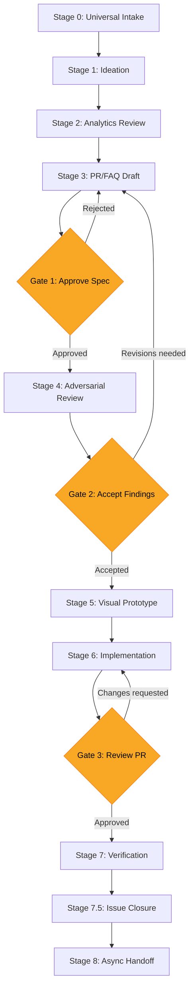
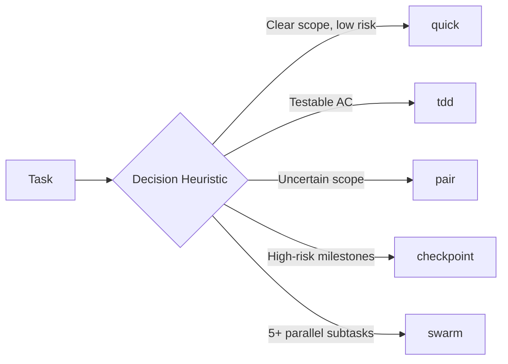

# Spec-Driven Development

A Claude Code plugin that defines the collaboration protocol between you and your AI agent -- ownership boundaries, adversarial review gates, execution mode routing, drift prevention, and evidence-based closure from spec to ship.

## Getting Started in 5 Minutes

```bash
# 1. Install
claude plugins add /path/to/spec-driven-development

# 2. Verify (ask Claude)
# "What execution modes are available?"
# Expected: quick, tdd, pair, checkpoint, swarm

# 3. Use
# Tell Claude about your feature idea. Run /sdd:write-prfaq.
# The plugin guides you from there.
```

That's it. Everything below is depth on demand -- the plugin surfaces the right skill automatically based on what you're doing.

## What This Is

This plugin provides a complete methodology for spec-driven development with AI coding agents. It covers the full lifecycle: writing specs with Working Backwards methodology, reviewing them adversarially across multiple models, decomposing into tasks with automatic execution mode routing, implementing with drift prevention and hook enforcement, scoring closure quality quantitatively, and closing issues with evidence.

**Complements [Anthropic's product-management plugin](https://github.com/anthropics/knowledge-work-plugins/tree/main/product-management):** That plugin helps PMs *write* specs (roadmaps, stakeholder updates, PRDs). This plugin drives specs *through review, implementation, and closure* -- the orchestration layer between "spec approved" and "feature shipped."

## What Makes This Different

**The problem this solves:** Have you ever had your AI agent close an issue prematurely? Or refuse to act because it wasn't sure if it was allowed to? Or spend 30 minutes asking permission for things it should have done autonomously? Or watched it drift from the spec halfway through a session with no way to pull it back? These are ownership boundary failures -- and they're the most common source of friction in AI-assisted development.

1. **Agent ownership model** -- The only plugin that formalizes who closes issues, who sets priorities, and when the agent acts autonomously vs. defers to the human. A clear matrix prevents agents either doing too little (asking permission for everything) or too much (closing issues prematurely). Three-tier closure rules: auto-close, propose-close, and never-close.

2. **Adversarial review architecture** -- 4 architecture options from free CI agents to multi-model API pipelines, with cost/quality/automation trade-off analysis and ready-to-use GitHub Actions workflows. Option C includes a multi-model runtime script with model-agnostic abstraction via litellm, supporting configurable focus modes (security, performance, architecture) and built-in cost tracking.

3. **Execution mode routing** -- Tasks are tagged with one of 5 modes (quick/tdd/pair/checkpoint/swarm) that determine ceremony level, review cadence, and agent autonomy. Not just workflow types -- implementation strategy routing with a decision heuristic tree that makes mode selection reproducible and auditable.

4. **Working Backwards PR/FAQ** -- The only plugin combining Amazon-style Working Backwards methodology with adversarial spec techniques (pre-mortem failure scenarios, inversion analysis, research grounding requirements). Problem statements must not mention the solution. Four templates for different scope levels.

5. **Drift prevention** -- A re-anchoring protocol that re-reads the active spec, git diff, issue state, and unresolved review comments before every task. This prevents the most common failure mode in long sessions: the agent drifting from the spec as context accumulates. No more "I forgot what we were building."

6. **Hook enforcement** -- Claude Code hooks (SessionStart, PreToolUse, PostToolUse, Stop) that enforce workflow constraints at the runtime level, not just via prompts. A PostToolUse hook verifies that file writes align with the active spec before allowing continuation. Workflow rules become engineering constraints, not suggestions.

7. **Quality scoring** -- Quantitative 0-100 closure scores across three weighted dimensions: test quality (40%), scope coverage (30%), and review completeness (30%). Scores gate progression: 80+ enables auto-close, 60-79 proposes closure with gaps noted, below 60 blocks with specific deficiencies listed.

## Design Philosophy

This is a **methodology plugin**, not an execution plugin. The distinction matters:

- **Execution plugins** ship scripts, runtime tools, and automation that work with specific models, CLIs, or platforms. When the platform changes, the automation breaks.
- **Methodology plugins** teach the agent *how to work*: when to act autonomously, when to defer, how to structure reviews, how to select implementation strategies. The methodology transfers across tools.

The `~~placeholder~~` convention makes this explicit. Every tool reference (project tracker, CI/CD, deployment platform) is a placeholder you replace with your stack. The 9-stage funnel, ownership model, and review architecture work whether you use Linear or Jira, GitHub or GitLab, Vercel or AWS.

**Principles:**
1. **Ownership before autonomy** -- Define who owns what before defining what the agent can do
2. **Methodology over tooling** -- Portable practices that survive platform changes
3. **Adversarial before implementation** -- Stress-test specs before writing code
4. **Evidence over ceremony** -- Close with proof, not process

## How This Compares

The spec-driven development space for AI coding agents is active, with 30+ plugins addressing various aspects. Here's how this plugin fits:

**What we focus on that others don't:**
- Agent/human ownership boundaries with explicit closure rules
- Execution mode selection with decision heuristic tree (not just "what to build" but "how to build it")
- PR/FAQ methodology with pre-mortem and inversion analysis
- Drift prevention via re-anchoring protocol
- Hook enforcement at the Claude Code runtime level
- Codebase indexing for spec-aware code discovery
- Quality scoring with quantitative closure thresholds
- Context window management as codified agent behavior

**What others do better (and we acknowledge):**
- **Autonomous execution loops** -- Tools like claude-workflow ship shell scripts for unattended task queue processing. Our `/sdd:start` handles single-task routing with mode awareness. For unattended processing of tasks decomposed by `/sdd:decompose`, pair with a dedicated execution framework.
- **Dependency task graphs** -- Several plugins model bidirectional dependencies between tasks. Our `/sdd:decompose` produces ordered task lists with dependency annotations but does not enforce execution order programmatically.

**Complementary tools:**
These plugins address adjacent concerns and pair well with this methodology:
- [Anthropic's product-management plugin](https://github.com/anthropics/knowledge-work-plugins/tree/main/product-management) for spec writing and roadmap management
- Multi-model review tools for additional adversarial review configurations
- Autonomous execution frameworks for unattended processing of decomposed tasks

**Relationship to Anthropic's product-management plugin:**
We pick up where product-management leaves off. That plugin helps PMs write specs, manage roadmaps, and synthesize research. This plugin drives those specs through adversarial review, implementation with mode routing, drift-aware execution, and evidence-based closure.

## Installation

### From Claude Code

```bash
# Add as a plugin
claude plugins add /path/to/spec-driven-development

# Or symlink to your skills directory
ln -s /path/to/spec-driven-development ~/.claude/skills/spec-driven-development
```

### Manual

Clone the repo and symlink it into your Claude Code skills directory:

```bash
git clone https://github.com/cianos95-dev/spec-driven-development.git
ln -s "$(pwd)/spec-driven-development" ~/.claude/skills/spec-driven-development
```

## The Funnel

Every feature, fix, and infrastructure change flows through a 9-stage funnel with 3 human approval gates.



| Stage | What Happens | Gate |
|-------|-------------|------|
| 0. Universal Intake | Normalize ideas from any source into project tracker | -- |
| 1. Ideation | Explore problem space, gather context, index codebase | -- |
| 2. Analytics Review | Data-informed prioritization via connected analytics | -- |
| 3. PR/FAQ Draft | Write Working Backwards spec with pre-mortem | Gate 1: Human approves spec |
| 4. Adversarial Review | Multi-perspective stress test (up to multi-model) | Gate 2: Human accepts findings |
| 5. Visual Prototype | UI/UX mockups if applicable | -- |
| 6. Implementation | Code with execution mode routing and drift prevention | Gate 3: Human reviews PR |
| 7. Verification | Deploy, test, validate with quality scoring | -- |
| 7.5. Issue Closure | Evidence-based closure with quantitative score | -- |
| 8. Async Handoff | Session summary for continuity | -- |

## Commands

Commands are user-invoked workflows triggered with `/sdd:<command>`.

| Command | Description |
|---------|-------------|
| `/sdd:write-prfaq` | Interactive PR/FAQ drafting with template selection and research grounding |
| `/sdd:review` | Trigger adversarial spec review (Options A-D, including multi-model runtime) |
| `/sdd:decompose` | Break an epic/spec into atomic implementation tasks with mode labels |
| `/sdd:start` | Begin implementation with automatic execution mode routing |
| `/sdd:close` | Evaluate closure with quality scoring (0-100) and structured evidence |
| `/sdd:hygiene` | Audit open issues for label consistency, staleness, and ownership gaps |
| `/sdd:index` | Scan codebase for modules, patterns, and integration points before spec writing |
| `/sdd:anchor` | Re-read active spec, git state, and issue context to prevent drift |

## Skills

Skills are passive knowledge that Claude surfaces automatically when relevant context appears in conversation.

| Skill | Triggers On | What It Provides |
|-------|------------|-----------------|
| `spec-workflow` | Funnel stages, workflow planning | 9-stage funnel with gate definitions |
| `execution-modes` | Task implementation, mode selection | 5-mode taxonomy with decision heuristics |
| `issue-lifecycle` | Issue closure, status transitions | Agent/human ownership table, closure rules |
| `adversarial-review` | Spec review, quality assurance | 3 perspectives, 4 architecture options, multi-model runtime |
| `prfaq-methodology` | Spec writing, Working Backwards | 4 templates with research grounding requirements |
| `context-management` | Session planning, delegation | Subagent tiers, context budget rules |
| `drift-prevention` | Mid-session work, context loss risk | Re-anchoring protocol, spec drift detection |
| `hook-enforcement` | Workflow violations, runtime rules | Claude Code hook patterns for constraint enforcement |
| `quality-scoring` | Closure evaluation, review quality | 0-100 scoring rubric across test/coverage/review |
| `codebase-awareness` | New specs, code discovery | Index-informed spec writing, pattern detection |
| `project-cleanup` | Project normalization, convention enforcement | Classification matrix, naming rules, deletion protocol, 10 anti-patterns |
| `research-pipeline` | Literature review, paper discovery, research tools | 4-stage pipeline: discover, enrich, organize, synthesize |
| `zotero-workflow` | Zotero operations, metadata enrichment | Plugin sequence, Linter/Cita settings, safety rules, anti-patterns |
| `research-grounding` | Research-backed features, citation standards | Readiness label progression, PR/FAQ citation requirements |
| `platform-routing` | Cross-platform work, non-CLI sessions | Platform recommendations, hook-free exit checklist, context bridges |

## Cross-Platform Compatibility

The plugin works across Claude Code (CLI), Desktop Chat, and Cowork. Commands and skills are 100% portable -- only hooks and stdio MCPs are CLI-specific.

| Component | Claude Code | Desktop Chat | Cowork |
|-----------|:-----------:|:------------:|:------:|
| Commands & Skills | Full | Full | Full |
| Hooks (runtime enforcement) | Full | -- | -- |
| OAuth MCPs (Linear, GitHub) | Full | Full | Full |
| Stdio MCPs (Zotero, arXiv, S2) | Full | -- | -- |
| File system / git | Full | -- | -- |

**Where to do what:**

| Workflow | Recommended Platform |
|----------|---------------------|
| Spec drafting, PR/FAQ workshops, triage | **Cowork** -- interactive connectors, artefact generation |
| Context setup, client routing | **Desktop Chat** -- Projects system customizes context per domain |
| Implementation, TDD, adversarial review | **Claude Code** -- hooks, git, subagents, full MCP stack |

Context flows between surfaces via **Linear issues** (universal state bus) and **GitHub specs** -- no surface operates in isolation. The `platform-routing` skill provides detailed routing recommendations and a hook-free exit checklist for non-CLI sessions.

## Execution Modes



| Mode | When | Agent Autonomy | Ceremony |
|------|------|---------------|----------|
| `quick` | Small, well-understood changes | High | Minimal |
| `tdd` | Testable acceptance criteria | High | Red-green-refactor |
| `pair` | Uncertain scope, needs exploration | Low (human-in-loop) | Interactive |
| `checkpoint` | High-risk, milestone-gated | Medium | Pause at gates |
| `swarm` | 5+ independent parallel subtasks | High | Subagent orchestration |

## Adversarial Review Options

| Option | Cost | Automation | Model Quality | Setup |
|--------|------|-----------|---------------|-------|
| A: CI Agent | $0 | Full | Good | Low |
| B: Premium Agent | ~$40/mo | Full | Very Good | Low |
| C: Multi-Model Runtime | ~$2-8/review | Full | Best (configurable) | Medium |
| D: In-Session | $0 | Manual | Very Good | None |

Option C includes a model-agnostic runtime script using litellm for multi-model adversarial debate. Configure focus modes (security, performance, architecture) to scope the review. Built-in cost tracking per review.

GitHub Actions workflows for Options A and C are included in `skills/adversarial-review/references/`.

## Quality Scoring

`/sdd:close` evaluates issues across three weighted dimensions:

| Dimension | Weight | What It Measures |
|-----------|--------|-----------------|
| Test | 40% | Test coverage, tests passing, edge cases addressed |
| Coverage | 30% | Acceptance criteria addressed, scope completeness |
| Review | 30% | Review comments resolved, adversarial findings addressed |

**Score thresholds:**

| Score | Action |
|-------|--------|
| 80-100 | Auto-close eligible (if ownership rules permit) |
| 60-79 | Propose closure with evidence gaps noted |
| 0-59 | Block -- list specific deficiencies that must be addressed |

Scores are deterministic given the same inputs. The rubric is documented in `skills/quality-scoring/SKILL.md` and can be customized per project.

## Drift Prevention

Before every task, `/sdd:anchor` re-reads:

1. **Active spec** -- Frontmatter, acceptance criteria, and open questions from the PR/FAQ
2. **Git state** -- Diff since last commit, uncommitted changes, branch status
3. **Issue state** -- Current status, labels, and assignment from the project tracker
4. **Review comments** -- Unresolved adversarial findings and PR review threads

This prevents the most common failure mode in long sessions: the agent drifting from the spec as context accumulates. The re-anchoring protocol rebuilds ground truth from source artifacts rather than relying on accumulated session context.

The `drift-prevention` skill activates automatically when session length exceeds configurable thresholds, or can be triggered manually with `/sdd:anchor` at any time.

## Hook Enforcement

Optional Claude Code hooks that enforce workflow constraints at the runtime level:

| Hook | Trigger | What It Enforces |
|------|---------|-----------------|
| `SessionStart` | Session begins | Load active spec, verify context budget, set ownership scope |
| `PreToolUse` | Before file write | Verify write aligns with active spec acceptance criteria |
| `PostToolUse` | After tool execution | Check for ownership boundary violations, log evidence |
| `Stop` | Session ends | Run hygiene check, update issue status, generate handoff |

Hooks are in `hooks/` -- install by copying to your project's `.claude/hooks/` directory. Each hook is independent; enable only the enforcement level you need.

**Why hooks matter:** Prompt-based workflow rules are advisory. A determined agent (or a careless one) can ignore them. Hooks enforce constraints at the Claude Code runtime level, making violations structurally impossible rather than merely discouraged.

## Codebase Indexing

`/sdd:index` scans your repository and produces:

- **Module map** -- Directories, key exports, internal dependencies
- **Pattern summary** -- Frameworks, conventions, test patterns, naming schemes
- **Integration points** -- APIs, shared state, event buses, external service calls

The index feeds into `/sdd:write-prfaq` as a "Current Codebase Context" section, ensuring new specs account for existing patterns rather than proposing redundant implementations. The index is cached and incrementally updated on subsequent runs.

## Issue Closure Rules

The agent follows strict rules about when it can close issues:

| Condition | Quality Score | Action |
|-----------|--------------|--------|
| Agent assignee + single PR + merged + deploy green | >= 80 | Auto-close with evidence |
| Agent assignee + single PR + merged + deploy green | 60-79 | Propose closure with gaps noted |
| Multi-PR, research issues, complex scope | Any | Propose closure, await confirmation |
| Human-assigned or `needs:human-decision` | Any | Never auto-close |
| Any | < 60 | Block -- deficiencies must be addressed first |

## Customization

This plugin uses `~~placeholder~~` conventions for organization-specific values. Replace these with your own:

| Placeholder | Replace With | Example |
|-------------|-------------|---------|
| `~~team-name~~` | Your team/org name | `Acme Engineering` |
| `~~PREFIX-XXX~~` | Your issue prefix | `ACME-042` |
| `~~owner/repo~~` | Your GitHub org/repo | `acme/product` |
| `~~project-tracker~~` | Your tracker tool | `Linear`, `Jira`, `Asana` |
| `~~version-control~~` | Your VCS platform | `GitHub`, `GitLab` |
| `~~ci-cd~~` | Your CI/CD platform | `GitHub Actions`, `CircleCI` |
| `~~analytics~~` | Your analytics tool | `PostHog`, `Amplitude` |
| `~~deployment~~` | Your deploy platform | `Vercel`, `AWS`, `Railway` |
| `~~error-tracking~~` | Your error tracker | `Sentry`, `Bugsnag` |

## Connectors

The plugin works best with these connected services (see [CONNECTORS.md](CONNECTORS.md) for details):

**Required:** Project tracker (Linear, Jira, Asana) + Version control (GitHub, GitLab)

**Recommended:** CI/CD, Deployment platform, Analytics, Error tracking

**Data-informed closure:** Connect analytics (PostHog, Amplitude) and error tracking (Sentry) to enable Stage 7 data-informed verification. Quality scores incorporate deploy health and error rates when these connectors are available.

## Tools We Optimize For

This plugin's methodology is tool-agnostic (see [Customization](#customization)), but we test and document integration patterns for these specific tools:

### Core (configured in .mcp.json)

| Tool | Funnel Role | Why |
|------|-------------|-----|
| **Linear** | Issue tracking across all stages | Agent ownership model, label taxonomy, closure protocol |
| **GitHub** | Spec versioning + adversarial review | PR-based review, Actions for Options A/C, hook enforcement |

### Recommended

| Tool | Funnel Role | Education Tier? |
|------|-------------|-----------------|
| **Vercel** | Stage 5 previews + Stage 7 deployment | Hobby free; Pro via education |
| **v0.dev** | Stage 5 component generation | Free tier; Premium via .edu |
| **Sentry** | Stage 7 error tracking + quality scoring input | Education plan available |
| **PostHog** | Stage 2 analytics + Stage 7 data-informed closure | 1M events/mo free |
| **Firecrawl** | Research grounding (web data) | STUDENTEDU code for credits |

### Multi-IDE

| Tool | Role | Education Tier? |
|------|------|-----------------|
| **Claude Code** | Primary implementation environment | Included in Anthropic plan |
| **Cursor** | Parallel implementation | 1yr Pro free via education |
| **OpenAI Codex** | Background task delegation | Via OpenAI API |

The methodology is portable across IDEs. The spec format and funnel stages are tool-agnostic; only command invocation differs per environment.

### Additional Education Tiers

These tools pair well with the methodology and offer student pricing:

- **GitHub Student Pack** -- Copilot Pro, Actions minutes, partner offers
- **Figma** -- Professional free for students (design to v0 workflow)
- **JetBrains** -- All Products Pack free (alternative IDE)
- **1Password** -- 1yr free via GitHub Pack (credential management)

## Project Structure

```
spec-driven-development/
├── .claude-plugin/
│   └── marketplace.json          # Marketplace manifest
├── .mcp.json                    # Connector configuration
├── commands/
│   ├── write-prfaq.md           # Interactive PR/FAQ drafting
│   ├── review.md                # Adversarial spec review (multi-model)
│   ├── decompose.md             # Epic → atomic task breakdown
│   ├── start.md                 # Implementation with mode routing
│   ├── close.md                 # Evidence-based closure with quality scoring
│   ├── hygiene.md               # Issue health audit
│   ├── index.md                 # Codebase indexing for spec-aware discovery
│   └── anchor.md                # Drift prevention via re-anchoring
├── skills/
│   ├── execution-modes/
│   │   └── SKILL.md             # 5 modes + decision heuristics
│   ├── adversarial-review/
│   │   ├── SKILL.md             # Perspectives + architecture options
│   │   └── references/
│   │       ├── github-action-copilot.yml
│   │       ├── github-action-api.yml
│   │       └── multi-model-runtime.sh
│   ├── issue-lifecycle/
│   │   └── SKILL.md             # Ownership table + closure rules
│   ├── prfaq-methodology/
│   │   ├── SKILL.md             # Working Backwards method
│   │   └── templates/
│   │       ├── prfaq-feature.md
│   │       ├── prfaq-research.md
│   │       ├── prfaq-infra.md
│   │       └── prfaq-quick.md
│   ├── context-management/
│   │   └── SKILL.md             # Subagent delegation + context budget
│   ├── spec-workflow/
│   │   └── SKILL.md             # 9-stage funnel + 3 approval gates
│   ├── drift-prevention/
│   │   └── SKILL.md             # Re-anchoring protocol + drift detection
│   ├── hook-enforcement/
│   │   └── SKILL.md             # Runtime hook patterns + constraint enforcement
│   ├── quality-scoring/
│   │   └── SKILL.md             # 0-100 scoring rubric + threshold configuration
│   ├── codebase-awareness/
│   │   └── SKILL.md             # Index-informed spec writing + pattern detection
│   ├── project-cleanup/
│   │   └── SKILL.md             # Classification matrix, naming rules, deletion protocol
│   ├── research-grounding/
│   │   └── SKILL.md             # Readiness label progression + citation requirements
│   ├── research-pipeline/
│   │   └── SKILL.md             # 4-stage pipeline: discover, enrich, organize, synthesize
│   ├── zotero-workflow/
│   │   └── SKILL.md             # Plugin sequence, Linter/Cita settings, safety rules
│   └── platform-routing/
│       └── SKILL.md             # Cross-platform routing, hook-free exit checklist
├── hooks/
│   ├── session-start.sh         # Load spec, verify context budget
│   ├── pre-tool-use.sh          # Verify write alignment with spec
│   ├── post-tool-use.sh         # Check ownership boundary violations
│   └── stop.sh                  # Hygiene check, status update, handoff
├── examples/
│   ├── sample-prfaq.md          # Filled-out PR/FAQ
│   ├── sample-closure-comment.md # Closure comment with quality score
│   ├── sample-review-findings.md # Adversarial review output
│   ├── sample-index-output.md   # Codebase index example
│   └── sample-anchor-output.md  # Re-anchoring context rebuild
├── CONNECTORS.md                # Data source documentation
├── README.md
└── LICENSE                      # Apache 2.0
```

## Example Workflow

A typical end-to-end flow using this plugin:

1. **Index:** Run `/sdd:index` -- scan the codebase to understand existing patterns and modules
2. **Intake:** Idea arrives via chat, voice memo, or planning session
3. **Draft:** Run `/sdd:write-prfaq` -- select template, answer prompts, get a structured spec with codebase context
4. **Review:** Run `/sdd:review` -- choose Option D for immediate feedback, or commit spec to trigger Options A-C (including multi-model runtime)
5. **Address findings:** Revise spec based on Critical and Important findings
6. **Decompose:** Run `/sdd:decompose` -- spec breaks into atomic tasks with execution mode labels
7. **Implement:** Run `/sdd:start PROJ-042` -- task routes to the right execution mode. `/sdd:anchor` fires before each task to prevent drift
8. **Close:** Run `/sdd:close` -- quality score evaluates test/coverage/review, closure rules determine action, evidence is structured automatically
9. **Audit:** Run `/sdd:hygiene` periodically to catch label drift, stale issues, and ownership gaps

## Label Taxonomy

The plugin uses two label families:

**Spec lifecycle:** `spec:draft` → `spec:ready` → `spec:review` → `spec:implementing` → `spec:complete`

**Execution mode:** `exec:quick` | `exec:tdd` | `exec:pair` | `exec:checkpoint` | `exec:swarm`

Optional labels for additional workflows:
- `needs:human-decision` -- blocks agent from auto-closing
- `research:needs-grounding` → `research:literature-mapped` → `research:methodology-validated` → `research:expert-reviewed`
- `template:prfaq-feature` | `template:prfaq-infra` | `template:prfaq-research` | `template:prfaq-quick`

## License

Apache 2.0 -- see [LICENSE](LICENSE).
