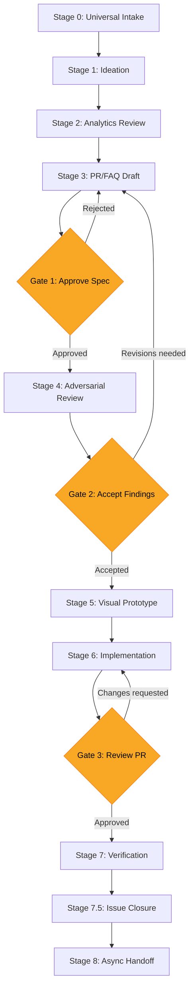
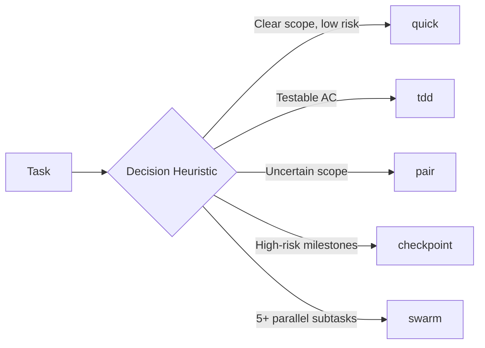

# Spec-Driven Development

A Claude Code plugin that drives software from spec to deployment with AI-agent-native ownership boundaries, adversarial review, and execution mode routing.

## Getting Started in 5 Minutes

```bash
# 1. Install
claude plugins add /path/to/spec-driven-development

# 2. Verify (ask Claude)
# "What execution modes are available?"
# Expected: quick, tdd, pair, checkpoint, swarm

# 3. Use
# Tell Claude about your feature idea. Run /sdd:write-prfaq.
# The plugin guides you from there.
```

That's it. Everything below is depth on demand -- the plugin surfaces the right skill automatically based on what you're doing.

## What This Is

This plugin provides a complete methodology for spec-driven development with AI coding agents. It covers the full lifecycle: writing specs, reviewing them adversarially, decomposing into tasks, implementing with the right execution strategy, and closing issues with evidence.

**Complements [Anthropic's product-management plugin](https://github.com/anthropics/knowledge-work-plugins/tree/main/product-management):** That plugin helps PMs *write* specs (roadmaps, stakeholder updates, PRDs). This plugin drives specs *through review, implementation, and closure* -- the orchestration layer between "spec approved" and "feature shipped."

## What Makes This Different

**The problem this solves:** Have you ever had your AI agent close an issue prematurely? Or refuse to act because it wasn't sure if it was allowed to? Or spend 30 minutes asking permission for things it should have done autonomously? These are ownership boundary failures -- and they're the most common source of friction in AI-assisted development.

1. **Agent ownership model** -- The only plugin that formalizes who closes issues, who sets priorities, and when the agent acts autonomously vs. defers to the human. A clear matrix prevents agents either doing too little (asking permission for everything) or too much (closing issues prematurely).
2. **Adversarial review architecture** -- 4 architecture options from free CI agents to Opus API pipelines, with cost/quality/automation trade-off analysis and ready-to-use GitHub Actions workflows. For teams wanting multi-model debate execution, pairs well with dedicated review tools.
3. **Execution mode routing** -- Tasks are tagged with one of 5 modes (quick/tdd/pair/checkpoint/swarm) that determine ceremony level, review cadence, and agent autonomy. Not just workflow types -- implementation strategy routing with explicit autonomy levels per mode.
4. **Working Backwards PR/FAQ** -- The only plugin combining Amazon-style Working Backwards methodology with adversarial spec techniques (pre-mortem failure scenarios, inversion analysis, research grounding requirements). Problem statements must not mention the solution.

## Design Philosophy

This is a **methodology plugin**, not an execution plugin. The distinction matters:

- **Execution plugins** ship scripts, runtime tools, and automation that work with specific models, CLIs, or platforms. When the platform changes, the automation breaks.
- **Methodology plugins** teach the agent *how to work*: when to act autonomously, when to defer, how to structure reviews, how to select implementation strategies. The methodology transfers across tools.

The `~~placeholder~~` convention makes this explicit. Every tool reference (project tracker, CI/CD, deployment platform) is a placeholder you replace with your stack. The 9-stage funnel, ownership model, and review architecture work whether you use Linear or Jira, GitHub or GitLab, Vercel or AWS.

**Principles:**
1. **Ownership before autonomy** -- Define who owns what before defining what the agent can do
2. **Methodology over tooling** -- Portable practices that survive platform changes
3. **Adversarial before implementation** -- Stress-test specs before writing code
4. **Evidence over ceremony** -- Close with proof, not process

## How This Compares

The spec-driven development space for AI coding agents is active, with 30+ plugins addressing various aspects. Here's how this plugin fits:

**What we focus on that others don't:**
- Agent/human ownership boundaries with explicit closure rules
- Execution mode selection (not just "what to build" but "how to build it")
- PR/FAQ methodology with pre-mortem and inversion analysis
- Context window management as codified agent behavior

**What others do better (and we acknowledge):**
- **Multi-model review execution** -- Tools like adversarial-spec ship runtime scripts for multi-LLM debate. We provide the architecture and reference workflows but not runtime tooling (yet).
- **Autonomous execution loops** -- Several plugins offer unattended task queue processing. Our `/sdd:start` handles single-task routing.
- **Hook enforcement** -- Some plugins enforce workflow rules via Claude Code hooks rather than prompt instructions.
- **Codebase indexing** -- Automatic code discovery before spec writing is not yet part of our workflow.

**Complementary tools:**
These plugins address gaps we acknowledge and pair well with this methodology:
- Multi-model review tools (for runtime execution of our Option C architecture)
- Autonomous execution frameworks (for unattended processing of tasks decomposed by `/sdd:decompose`)
- Codebase indexing tools (for code discovery before spec writing)

**Relationship to Anthropic's product-management plugin:**
We pick up where product-management leaves off. That plugin helps PMs write specs, manage roadmaps, and synthesize research. This plugin drives those specs through adversarial review, implementation with mode routing, and evidence-based closure.

## Installation

### From Claude Code

```bash
# Add as a plugin
claude plugins add /path/to/spec-driven-development

# Or symlink to your skills directory
ln -s /path/to/spec-driven-development ~/.claude/skills/spec-driven-development
```

### Manual

Clone the repo and symlink it into your Claude Code skills directory:

```bash
git clone https://github.com/cianosullivan/spec-driven-development.git
ln -s "$(pwd)/spec-driven-development" ~/.claude/skills/spec-driven-development
```

## The Funnel

Every feature, fix, and infrastructure change flows through a 9-stage funnel with 3 human approval gates.



| Stage | What Happens | Gate |
|-------|-------------|------|
| 0. Universal Intake | Normalize ideas from any source into project tracker | -- |
| 1. Ideation | Explore problem space, gather context | -- |
| 2. Analytics Review | Data-informed prioritization | -- |
| 3. PR/FAQ Draft | Write Working Backwards spec | Gate 1: Human approves spec |
| 4. Adversarial Review | 3-perspective stress test | Gate 2: Human accepts findings |
| 5. Visual Prototype | UI/UX mockups if applicable | -- |
| 6. Implementation | Code with execution mode routing | Gate 3: Human reviews PR |
| 7. Verification | Deploy, test, validate | -- |
| 7.5. Issue Closure | Evidence-based closure protocol | -- |
| 8. Async Handoff | Session summary for continuity | -- |

## Commands

Commands are user-invoked workflows triggered with `/sdd:<command>`.

| Command | Description |
|---------|-------------|
| `/sdd:write-prfaq` | Interactive PR/FAQ drafting with template selection |
| `/sdd:review` | Trigger adversarial spec review (Options A-D) |
| `/sdd:decompose` | Break an epic/spec into atomic implementation tasks |
| `/sdd:start` | Begin implementation with automatic execution mode routing |
| `/sdd:close` | Evaluate closure conditions and close with evidence |
| `/sdd:hygiene` | Audit open issues for label consistency and staleness |

## Skills

Skills are passive knowledge that Claude surfaces automatically when relevant context appears in conversation.

| Skill | Triggers On | What It Provides |
|-------|------------|-----------------|
| `spec-workflow` | Funnel stages, workflow planning | 9-stage funnel with gate definitions |
| `execution-modes` | Task implementation, mode selection | 5-mode taxonomy with decision heuristics |
| `issue-lifecycle` | Issue closure, status transitions | Agent/human ownership table, closure rules |
| `adversarial-review` | Spec review, quality assurance | 3 perspectives, 4 architecture options |
| `prfaq-methodology` | Spec writing, Working Backwards | 4 templates with research grounding |
| `context-management` | Session planning, delegation | Subagent tiers, context budget rules |

## Execution Modes



| Mode | When | Agent Autonomy | Ceremony |
|------|------|---------------|----------|
| `quick` | Small, well-understood changes | High | Minimal |
| `tdd` | Testable acceptance criteria | High | Red-green-refactor |
| `pair` | Uncertain scope, needs exploration | Low (human-in-loop) | Interactive |
| `checkpoint` | High-risk, milestone-gated | Medium | Pause at gates |
| `swarm` | 5+ independent parallel subtasks | High | Subagent orchestration |

## Adversarial Review Options

| Option | Cost | Automation | Model Quality | Setup |
|--------|------|-----------|---------------|-------|
| A: CI Agent | $0 | Full | Good | Low |
| B: Premium Agent | ~$40/mo | Full | Very Good | Low |
| C: API + Actions | ~$2-8/review | Full | Best (configurable) | Medium |
| D: In-Session | $0 | Manual | Very Good | None |

GitHub Actions workflows for Options A and C are included in `skills/adversarial-review/references/`.

## Issue Closure Rules

The agent follows strict rules about when it can close issues:

| Condition | Action |
|-----------|--------|
| Agent assignee + single PR + merged + deploy green | Auto-close with evidence |
| Multi-PR, research issues, complex scope | Propose closure, await confirmation |
| Human-assigned or `needs:human-decision` | Never auto-close |

## Customization

This plugin uses `~~placeholder~~` conventions for organization-specific values. Replace these with your own:

| Placeholder | Replace With | Example |
|-------------|-------------|---------|
| `~~team-name~~` | Your team/org name | `Acme Engineering` |
| `~~PREFIX-XXX~~` | Your issue prefix | `ACME-042` |
| `~~owner/~~repo~~` | Your GitHub org/repo | `acme/product` |
| `~~project-tracker~~` | Your tracker tool | `Linear`, `Jira`, `Asana` |
| `~~version-control~~` | Your VCS platform | `GitHub`, `GitLab` |
| `~~ci-cd~~` | Your CI/CD platform | `GitHub Actions`, `CircleCI` |
| `~~analytics~~` | Your analytics tool | `PostHog`, `Amplitude` |
| `~~deployment~~` | Your deploy platform | `Vercel`, `AWS`, `Railway` |

## Connectors

The plugin works best with these connected services (see [CONNECTORS.md](CONNECTORS.md) for details):

**Required:** Project tracker (Linear, Jira, Asana) + Version control (GitHub, GitLab)

**Recommended:** CI/CD, Deployment platform, Analytics

## Tools We Optimize For

This plugin's methodology is tool-agnostic (see [Customization](#customization)), but we test and document integration patterns for these specific tools:

### Core (configured in .mcp.json)

| Tool | Funnel Role | Why |
|------|-------------|-----|
| **Linear** | Issue tracking across all stages | Agent ownership model, label taxonomy, closure protocol |
| **GitHub** | Spec versioning + adversarial review | PR-based review, Actions for Options A/C, Copilot code review rules |

### Recommended

| Tool | Funnel Role | Education Tier? |
|------|-------------|-----------------|
| **Vercel** | Stage 5 previews + Stage 7 deployment | Hobby free; Pro via education |
| **v0.dev** | Stage 5 component generation | Free tier; Premium via .edu |
| **Sentry** | Stage 7 error tracking | Education plan available |
| **PostHog** | Stage 2 analytics + Stage 7 behavior | 1M events/mo free |
| **Firecrawl** | Research grounding (web data) | STUDENTEDU code for credits |

### Multi-IDE (v2)

| Tool | Role | Education Tier? |
|------|------|-----------------|
| **Claude Code** | Primary implementation environment | Included in Anthropic plan |
| **Cursor** | Parallel implementation | 1yr Pro free via education |
| **OpenAI Codex** | Background task delegation | Via OpenAI API |

### Additional Education Tiers

These tools pair well with the methodology and offer student pricing:

- **GitHub Student Pack** -- Copilot Pro, Actions minutes, partner offers
- **Figma** -- Professional free for students (design to v0 workflow)
- **JetBrains** -- All Products Pack free (alternative IDE)
- **1Password** -- 1yr free via GitHub Pack (credential management)

## Project Structure

```
spec-driven-development/
├── .claude-plugin/
│   └── plugin.json              # Plugin manifest
├── .mcp.json                    # Connector configuration
├── commands/
│   ├── write-prfaq.md           # Interactive PR/FAQ drafting
│   ├── review.md                # Adversarial spec review
│   ├── decompose.md             # Epic → atomic task breakdown
│   ├── start.md                 # Implementation with mode routing
│   ├── close.md                 # Evidence-based issue closure
│   └── hygiene.md               # Issue health audit
├── skills/
│   ├── execution-modes/
│   │   └── SKILL.md             # 5 modes + decision heuristics
│   ├── adversarial-review/
│   │   ├── SKILL.md             # Perspectives + architecture options
│   │   └── references/
│   │       ├── github-action-copilot.yml
│   │       └── github-action-api.yml
│   ├── issue-lifecycle/
│   │   └── SKILL.md             # Ownership table + closure rules
│   ├── prfaq-methodology/
│   │   ├── SKILL.md             # Working Backwards method
│   │   └── templates/
│   │       ├── prfaq-feature.md
│   │       ├── prfaq-research.md
│   │       ├── prfaq-infra.md
│   │       └── prfaq-quick.md
│   ├── context-management/
│   │   └── SKILL.md             # Subagent delegation + context budget
│   └── spec-workflow/
│       └── SKILL.md             # 9-stage funnel + 3 approval gates
├── examples/
│   ├── sample-prfaq.md          # Filled-out PR/FAQ
│   ├── sample-closure-comment.md # Closure comment examples
│   └── sample-review-findings.md # Adversarial review output
├── CONNECTORS.md                # Data source documentation
├── README.md
└── LICENSE                      # Apache 2.0
```

## Example Workflow

A typical end-to-end flow using this plugin:

1. **Intake:** Idea arrives via chat, voice memo, or planning session
2. **Draft:** Run `/sdd:write-prfaq` -- select template, answer prompts, get a structured spec
3. **Review:** Run `/sdd:review` -- choose Option D for immediate feedback or commit spec to trigger Options A-C
4. **Address findings:** Revise spec based on Critical and Important findings
5. **Decompose:** Run `/sdd:decompose` -- spec breaks into atomic tasks with execution mode labels
6. **Implement:** Run `/sdd:start PROJ-042` -- task routes to the right execution mode automatically
7. **Close:** Run `/sdd:close` -- evaluates closure conditions, adds evidence, transitions status
8. **Audit:** Run `/sdd:hygiene` periodically to catch label drift and stale issues

## Label Taxonomy

The plugin uses two label families:

**Spec lifecycle:** `spec:draft` → `spec:ready` → `spec:review` → `spec:implementing` → `spec:complete`

**Execution mode:** `exec:quick` | `exec:tdd` | `exec:pair` | `exec:checkpoint` | `exec:swarm`

Optional labels for additional workflows:
- `needs:human-decision` -- blocks agent from auto-closing
- `research:needs-grounding` → `research:literature-mapped` → `research:methodology-validated` → `research:expert-reviewed`
- `template:prfaq-feature` | `template:prfaq-infra` | `template:prfaq-research` | `template:prfaq-quick`

## Roadmap

Planned for future versions (informed by competitive analysis):

- **Drift prevention** -- Re-anchoring protocol that re-reads specs before every task to prevent context drift
- **Hook enforcement** -- Claude Code hooks that enforce workflow constraints at the engineering level
- **Quality scoring** -- Quantitative 0-100 score in `/sdd:close` across test, coverage, and review dimensions
- **Codebase indexing** -- `/sdd:index` command for code discovery before spec writing
- **Multi-model review runtime** -- Script for executing Option C with model-agnostic abstraction

See `docs/competitive-analysis.md` for the full competitive landscape informing this roadmap.

## License

Apache 2.0 -- see [LICENSE](LICENSE).
