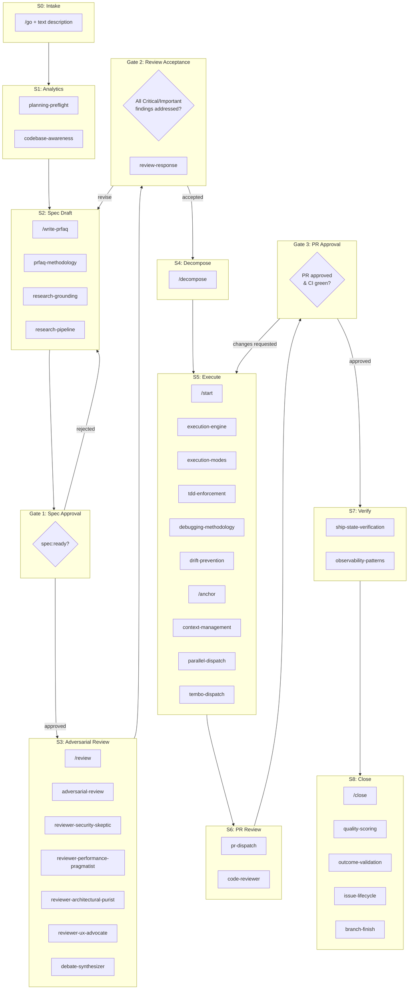
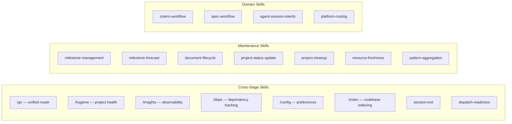
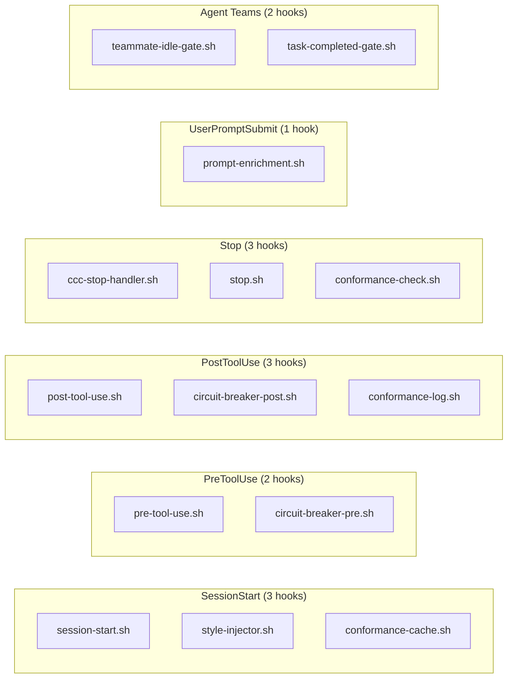

# CCC Architecture: 9-Stage Funnel

The CCC plugin orchestrates work through a 9-stage funnel (S0-S8) with 3 quality gates. Skills, commands, agents, and hooks each play distinct roles at specific stages.

## Stage Funnel

## Cross-Stage Skills

These skills operate across multiple stages rather than belonging to a single one:

## Enforcement Layer (Hooks)

## Agent Roles

| Agent | Role | Stage |
|-------|------|-------|
| `spec-author` | Drafts specs from intake | S2 |
| `reviewer` | Base adversarial reviewer | S3 |
| `reviewer-security-skeptic` | Security-focused review | S3 |
| `reviewer-performance-pragmatist` | Performance-focused review | S3 |
| `reviewer-architectural-purist` | Architecture-focused review | S3 |
| `reviewer-ux-advocate` | UX-focused review | S3 |
| `debate-synthesizer` | Reconciles review personas | S3 |
| `implementer` | Executes spec-to-code | S5 |
| `code-reviewer` | PR-level code review | S6 |

## Command Quick Reference

| Command | Primary Stage | Purpose |
|---------|--------------|---------|
| `/go` | Router | Unified entry point — detects context, routes to stage |
| `/write-prfaq` | S2 | Interactive PR/FAQ spec generation |
| `/review` | S3 | Adversarial review with 4 personas + debate |
| `/decompose` | S4 | Break issue into ordered sub-tasks |
| `/start` | S5 | Begin execution of current task |
| `/anchor` | S5 | Re-anchor to spec (drift prevention) |
| `/close` | S8 | Evidence-based closure with quality scoring |
| `/hygiene` | Cross | Project health audit (7 check groups) |
| `/insights` | Cross | Observability and methodology metrics |
| `/deps` | Cross | Dependency tracking and resolution |
| `/config` | Cross | Preferences management |
| `/index` | Cross | Codebase indexing |
| `/self-test` | Cross | In-session plugin validation |
| `/template-validate` | Cross | Template structure validation |
| `/template-bootstrap` | Cross | First-time template provisioning |
| `/template-sync` | Cross | Template drift correction |
| `/status-update` | Cross | Weekly initiative status sync |
