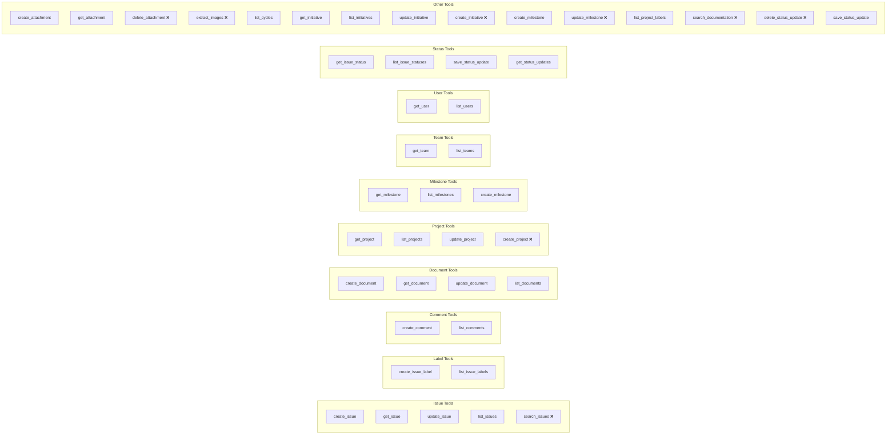

# Linear MCP Integration Map

Maps which CCC skills and commands call which Linear MCP tools. Identifies coverage gaps (tools with no callers) and highlights GraphQL fallback points.

> **Note:** This map reflects plugin state as of v1.8.4 (Feb 19, 2026). Update after adding new skills that consume Linear tools.

## Tool Coverage Overview

## Caller Matrix

| Linear MCP Tool | Primary Callers (Skills/Commands) |
|----------------|----------------------------------|
| **Issue Tools** | |
| `create_issue` | `/go` (intake), `/decompose` (sub-issues), `issue-lifecycle` |
| `get_issue` | `/go` (routing), `/close` (evidence), `/review`, `dispatch-readiness`, `dependency-management`, `issue-lifecycle` |
| `update_issue` | `/go` (status), `/close` (labels), `/start` (In Progress), `issue-lifecycle`, `dependency-management` |
| `list_issues` | `/hygiene` (staleness), `/go --next`, `/go --scan`, `dispatch-readiness`, `project-cleanup`, `planning-preflight` |
| `search_issues` | _Not currently used_ |
| **Label Tools** | |
| `create_issue_label` | `/go` (exec labels), `issue-lifecycle` (auto labels) |
| `list_issue_labels` | `/hygiene` (label consistency), `issue-lifecycle` |
| **Comment Tools** | |
| `create_comment` | `/review` (findings), `/close` (evidence), `/start` (execution log), `pr-dispatch` |
| `list_comments` | `/go` (Gate 2 check), `/review` (prior findings), `review-response` |
| **Document Tools** | |
| `create_document` | `document-lifecycle` (new docs) |
| `get_document` | `document-lifecycle` (read), `resource-freshness` (staleness) |
| `update_document` | `document-lifecycle` (updates), `project-status-update` |
| `list_documents` | `resource-freshness` (Category 4), `/hygiene` (doc health), `document-lifecycle` |
| **Project Tools** | |
| `get_project` | `/go` (context), `resource-freshness` (Category 1), `project-cleanup` |
| `list_projects` | `resource-freshness` (all projects), `project-cleanup`, `/hygiene` |
| `update_project` | `project-cleanup` (description updates), `project-status-update` |
| `create_project` | _Not currently used_ |
| **Milestone Tools** | |
| `get_milestone` | `milestone-management`, `milestone-forecast` |
| `list_milestones` | `milestone-management`, `resource-freshness` (Category 3), `/go` (assignment) |
| `create_milestone` | `milestone-management` |
| **Team Tools** | |
| `get_team` | `resource-freshness` (team context), `/hygiene` |
| `list_teams` | `resource-freshness` (workspace scan) |
| **User Tools** | |
| `get_user` | `issue-lifecycle` (assignment checks) |
| `list_users` | `issue-lifecycle` (agent identity) |
| **Status Tools** | |
| `get_issue_status` | `issue-lifecycle` (status validation) |
| `list_issue_statuses` | `issue-lifecycle` (valid status enumeration) |
| `save_status_update` | `project-status-update` (initiative updates) |
| `get_status_updates` | `resource-freshness` (Category 2), `project-status-update` |
| **Initiative Tools** | |
| `get_initiative` | `project-status-update`, `resource-freshness` (Category 2) |
| `list_initiatives` | `project-status-update`, `resource-freshness` |
| `update_initiative` | `project-status-update` |
| `create_initiative` | _Not currently used_ |
| **Cycle Tools** | |
| `list_cycles` | `milestone-management` (cycle alignment), `issue-lifecycle` |
| **Attachment Tools** | |
| `create_attachment` | `document-lifecycle` (spec attachment) |
| `get_attachment` | `document-lifecycle` (read attachment) |
| `delete_attachment` | _Not currently used_ |
| **Other Tools** | |
| `extract_images` | _Not currently used_ |
| `search_documentation` | _Not currently used_ |
| `delete_status_update` | _Not currently used_ |
| `list_project_labels` | `/hygiene` (label consistency) |
| `update_milestone` | _Not currently used (milestone-management uses get + create pattern)_ |

## Coverage Summary

| Category | Total Tools | With Callers | No Callers |
|----------|------------|--------------|-----------|
| Issues | 5 | 4 | 1 (`search_issues`) |
| Labels | 2 | 2 | 0 |
| Comments | 2 | 2 | 0 |
| Documents | 4 | 4 | 0 |
| Projects | 4 | 3 | 1 (`create_project`) |
| Milestones | 3 | 3 | 0 |
| Teams | 2 | 2 | 0 |
| Users | 2 | 2 | 0 |
| Status | 4 | 4 | 0 |
| Initiatives | 4 | 3 | 1 (`create_initiative`) |
| Cycles | 1 | 1 | 0 |
| Attachments | 3 | 2 | 1 (`delete_attachment`) |
| Other | 3 | 1 | 2 (`extract_images`, `search_documentation`) |
| **Total** | **39** | **33** | **6** |

## Uncovered Tools Analysis

| Tool | Reason Not Used | Action |
|------|----------------|--------|
| `search_issues` | `list_issues` with filters covers most cases | Low priority — add if filter complexity increases |
| `create_project` | Projects created manually (rare, strategic) | No action — intentionally manual |
| `create_initiative` | Initiatives created manually (strategic) | No action — intentionally manual |
| `delete_attachment` | Attachments are not deleted in normal workflow | No action — edge case |
| `extract_images` | No image extraction use case in CCC | No action |
| `search_documentation` | `list_documents` + manual filtering is sufficient | Consider for large doc sets |
| `delete_status_update` | Status updates are append-only in CCC | No action — intentional |
| `update_milestone` | `milestone-management` uses create pattern | Consider for date extensions |

## GraphQL Fallback Points

Linear MCP tools don't cover all Linear API capabilities. These operations require GraphQL API fallback:

| Operation | Why No MCP Tool | Fallback |
|-----------|----------------|----------|
| Issue history (field changes) | No `get_issue_history` tool | `IssueHistory` GraphQL query |
| Bulk issue updates | No batch tool | Sequential `update_issue` calls |
| Dependency creation/deletion | Limited relation tools | `issueRelationCreate` / `issueRelationDelete` mutations |
| Custom views/filters | No view tools | Linear UI or GraphQL `customViews` |
| Webhook management | No webhook tools | Linear Settings UI or GraphQL |
| Triage Intelligence access | No triage tools | Linear UI only |
