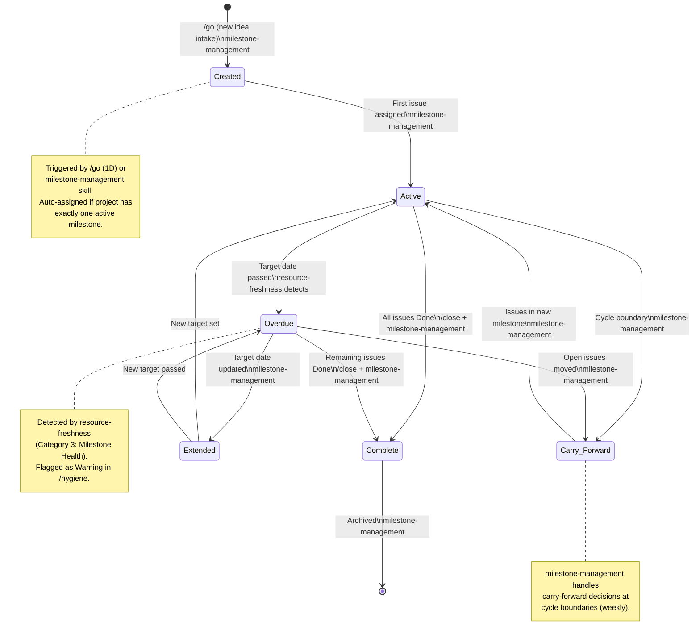
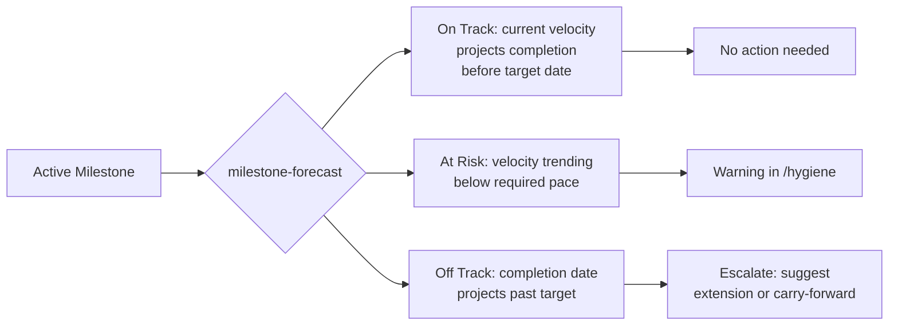

# Milestone Lifecycle

State transitions for CCC milestones, annotated with the skills and commands that trigger each transition.

## State Diagram

## Transition Details

| Transition | Trigger | Skill/Command | Detection |
|-----------|---------|--------------|-----------|
| Created | New milestone created | `milestone-management` | Manual or auto via `/go` intake |
| Created -> Active | First issue assigned to milestone | `milestone-management` | Issue assignment event |
| Active -> Complete | All issues reach Done/Canceled | `/close` + `milestone-management` | Last issue closed |
| Active -> Overdue | Target date passes with open issues | `resource-freshness` | Category 3 check in `/hygiene` |
| Active -> Carry-Forward | Cycle boundary with incomplete issues | `milestone-management` | Weekly cycle start |
| Overdue -> Extended | Target date manually updated | `milestone-management` | User action |
| Overdue -> Carry-Forward | Decision to move open issues forward | `milestone-management` | User decision via `/hygiene` |
| Overdue -> Complete | Remaining issues completed | `/close` | All issues resolved |
| Extended -> Active | Returns to active tracking | Automatic | Target date now in future |
| Extended -> Overdue | New target also passes | `resource-freshness` | Category 3 re-check |
| Carry-Forward -> Active | Issues land in new milestone | `milestone-management` | Carry-forward protocol |
| Complete -> Archived | Milestone archived after completion | `milestone-management` | Manual or auto after retention period |

## Health Signals

The `resource-freshness` skill (Category 3: Milestone Health) monitors these signals:

| Signal | Severity | Threshold |
|--------|----------|-----------|
| Target date passed with open issues | Warning | `targetDate < today && openIssues > 0` |
| Due soon with low completion | Warning | Due in 3 days, <50% complete |
| Stalled (zero completion after threshold) | Warning | Issues exist but 0% Done after N days |
| Empty milestone | Info | Milestone has no issues assigned |
| All Done but not marked complete | Info | Target passed, 0 open issues, still active |

## Milestone Forecast Integration

The `milestone-forecast` skill provides predictive analysis:

## Cross-Skill References

| Skill | Role in Lifecycle |
|-------|------------------|
| `milestone-management` | Primary lifecycle manager — creation, assignment, carry-forward, completion, archival |
| `milestone-forecast` | Predictive analysis — velocity-based date projection, risk scoring |
| `resource-freshness` | Health monitoring — overdue detection, stall detection, empty milestone flagging |
| `issue-lifecycle` | Issue-level state management within milestones |
| `/go` | Entry point — auto-assigns milestones on issue creation (Step 1D) |
| `/hygiene` | Aggregates milestone health findings from resource-freshness and milestone-management |
| `/close` | Triggers milestone completion check when closing the last issue in a milestone |
