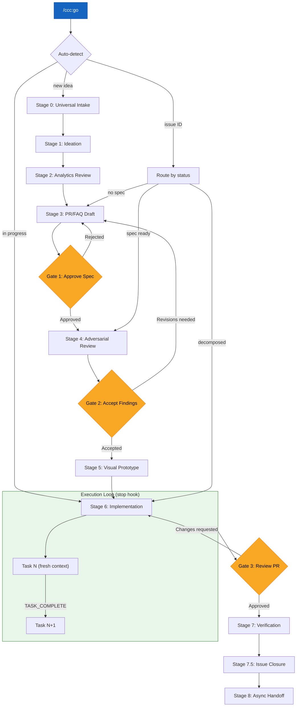
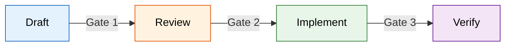

# Claude Command Centre Workflow

This is the complete funnel from idea to production. Every feature, fix, and infrastructure change flows through these stages. The funnel enforces three human approval gates and eliminates ambiguity about what is being built, why, and when it is done.

## Funnel Overview



## Unified Entry Point: `/ccc:go`

The `/ccc:go` command is the recommended way to interact with the funnel. It auto-detects your context and routes to the correct stage. All existing commands remain directly invocable (dual access model).

```
/ccc:go [argument] [--quick] [--mode MODE] [--status] [--next]
```

| Argument | Behavior |
|----------|----------|
| (none) | Check for active work, resume or ask what to build |
| `--status` | Show "You Are Here" text-based funnel view |
| `CIA-XXX` | Route by issue status to correct stage |
| `"free text"` | New idea --> intake --> spec draft |
| `--quick` | Collapse funnel for small tasks |
| `--next` | Pick up next unblocked task |

See the `/ccc:go` command definition and the **execution-engine** skill for full details.

## Fast Paths

Not every task needs the full 9-stage funnel. The execution mode determines which stages to skip:

| Execution Mode | Stages Used | Stages Skipped | Typical Use |
|---------------|-------------|----------------|-------------|
| `quick` | 0, 3 (quick template), 6, 7, 7.5 | 1, 2, 4, 5, 8 | Bug fixes, small features, config changes |
| `tdd` | 0, 3, 6, 7, 7.5 | 2, 4, 5, 8 | Well-defined features with clear acceptance criteria |
| `pair` | 0, 1, 3, 4, 6, 7, 7.5 | 2, 5, 8 | Uncertain scope requiring human-in-the-loop |
| `checkpoint` | All stages | None | High-risk changes, infrastructure, breaking changes |
| `swarm` | 0, 3, 4, 6, 7, 7.5 | 2, 5, 8 | Large scope decomposed into parallel subtasks |

**Rule of thumb:** If the task can be described in one sentence and has an obvious implementation, use `quick` and skip to Stage 6 after intake. The full funnel is the maximum envelope, not the minimum ceremony.

## Stage Reference

| # | Stage | Environment | Key Tools | Gate |
|---|-------|-------------|-----------|------|
| 0 | Universal Intake | Any surface | ~~project-tracker~~ | None (normalization) |
| 1 | Ideation | Collaborative session / chat | ~~project-tracker~~ MCP | None |
| 2 | Analytics Review | Coding tool | ~~analytics-platform~~ | None (informational) |
| 3 | PR/FAQ Draft | Collaborative session | PR/FAQ templates, ~~project-tracker~~ MCP | **Human: approve spec** |
| 4 | Adversarial Review | ~~ci-cd~~ | Review options A-H, RDR table | **Human: accept findings (via RDR)** |
| 5 | Visual Prototype | ~~design-tool~~ | ~~version-control~~ integration | None (skip for non-UI) |
| 6 | Implementation | Coding tool | Subagents, model mixing | **Human: review PR** |
| 7 | Verification | ~~deployment-platform~~ | Preview deploy, analytics check | Merge to production |
| 7.5 | Issue Closure | Coding tool + ~~project-tracker~~ | Metadata-driven closure rules | Auto/propose per rules |
| 8 | Async Handoff | ~~remote-execution~~ | Remote dispatch | N/A |

> See [references/stage-details.md](references/stage-details.md) for the full stage-by-stage breakdown with activities, outputs, and skip conditions.

## Gate 1: Approve Spec (Stage 3 exit)

**Who:** Human (spec author or stakeholder)
**Decision:** Is this spec clear enough and valuable enough to invest in review and implementation?
**On approval:** `spec:draft` --> `spec:ready`
**On rejection:** Return to Stage 3 with feedback. Issue remains `spec:draft`.

## Gate 2: Accept Findings (Stage 4 exit)

**Who:** Human (spec author)
**Decision:** Are the review findings acceptable? Do any Critical items need to be addressed first?
**Mechanism:** The human fills Decision and Response columns in the **Review Decision Record** (RDR) table posted as a project tracker comment. Gate 2 passes when all Critical and Important findings have a Decision value (`agreed`, `override`, `deferred`, or `rejected`). See the `adversarial-review` skill for the RDR format and decision vocabulary.
**On acceptance:** Proceed to Stage 5 (or Stage 6 if non-UI). Update label to `spec:review`.
**On REVISE:** Return to Stage 3 to address Critical and Important findings.
**On RETHINK:** Return to Stage 1 to reconsider the fundamental approach.

## Gate 3: Review PR (Stage 6 exit)

**Who:** Human (code reviewer)
**Decision:** Does the implementation match the spec? Are there quality, security, or performance concerns?
**On approval:** Merge and proceed to Stage 7.
**On changes requested:** Return to Stage 6 to address feedback.

## Approval Gates Summary

The three gates are the only points where human judgment is required. Everything else can be automated or agent-driven.



1. **Approve spec** (Stage 3 exit) -- Confirms the problem is worth solving and the approach is sound.
2. **Accept review findings** (Stage 4 exit) -- Confirms the spec survives adversarial scrutiny.
3. **Review PR** (Stage 6 exit) -- Confirms the implementation matches the spec.

Everything before Gate 1 is exploration. Everything between Gate 1 and Gate 3 is execution. Everything after Gate 3 is verification.

## Stage Transitions and Labels

The ~~project-tracker~~ labels track where an issue is in the funnel:

| Label | Meaning | Set When |
|-------|---------|----------|
| `spec:draft` | PR/FAQ written, awaiting approval | Stage 3 complete |
| `spec:ready` | Spec approved, ready for review | Gate 1 passed |
| `spec:review` | Under adversarial review | Stage 4 in progress |
| `spec:implementing` | Code is being written | Stage 6 in progress |
| `spec:complete` | Shipped and verified | Stage 7.5 closure |

## Master Plan Pattern

When batched or sequential work spans 2+ sessions, create a **master session plan issue** in the project tracker. This is the tracking artifact that keeps multi-session work visible and accountable.

**Structure:**
- The master issue has sub-issues for each session or step in the plan
- The plan file (stored locally, e.g., `~/.claude/plans/`) is the execution blueprint; the project tracker issue is the tracking artifact that others can follow
- Sub-issues are created upfront during planning, not discovered during execution

**Two-session gate:**
- **Session 1** = decisions, research, and planning. Produce recommendations, not changes.
- **Human review gate** between sessions. The human reviews Session 1 output before Session 2 begins.
- **Session 2** = execution. Apply the decisions made and approved in Session 1.

**Why separate sessions:** Never mix research/decisions and execution in the same session. Empirically, combining both leads to >70% context consumption (compaction risk), rushed decisions late in the session, and execution that outpaces approval. The two-session gate forces deliberate pacing.

**When to use:** Any task that requires both "figuring out what to do" and "doing it" across more than a trivial scope. If the research phase alone could consume >30% of context, split into sessions.

## Scope Discipline

Scope creep is the primary risk to session success. These rules are **structural guards**, not suggestions.

**Pilot batch before bulk:** When a task affects 10+ items, do a pilot batch of 3-5 first. Verify results, then proceed. This catches systematic errors when they are cheap to fix.

**Approach confirmation:** Before executing a plan touching >5 files or >10 issues, confirm the approach. "The plan is right" and "my execution of the plan is right" are two different claims.

**Scope creep guard:** If during execution you discover new work, create a sub-issue immediately. NEVER add scope to the parent issue. The new work enters the funnel at Stage 0 like everything else.

**Anti-pattern — "while I'm here":** Resist fixing adjacent issues during implementation. Log them as new issues. Adjacent fixes bypass spec and review gates. Only exception: trivially mechanical fixes (typo on the same line) requiring zero judgment.

## Human Review Gate Enforcement

- No gate can be skipped, even for `quick` mode (which still requires Gate 3: PR review)
- Gates are synchronization points: agent stops, human catches up, then work resumes
- Passing a gate is an **explicit human action** (approval comment, PR approval), never implicit

**Architectural decisions require split sessions:** Any change to architecture, data models, or cross-cutting concerns → Session 1 produces proposal, human reviews, Session 2 executes only what was approved. The inter-session review is NOT optional.

**Evidence format:** Summary tables (not raw dumps), linked to tracker issues, with explicit recommendation (approve/revise/reject/defer). Human should decide in under 5 minutes of reading.

## Cross-Skill References

This workflow integrates with the other skills in this plugin:

- **execution-engine** -- Powers Stage 6 (stop hook task loop, `.ccc-state.json`, `.ccc-progress.md`, gate pauses, retry budget)
- **prfaq-methodology** -- Governs Stage 3 (PR/FAQ drafting process, templates, interactive questioning)
- **adversarial-review** -- Governs Stage 4 (reviewer perspectives, architecture options A-H, Review Decision Record for Gate 2)
- **execution-modes** -- Governs Stage 6 (quick, tdd, pair, checkpoint, swarm routing)
- **issue-lifecycle** -- Governs Stage 7.5 (closure rules, evidence requirements, ownership boundaries)
- **context-management** -- Applies across all stages (subagent delegation, output brevity, model mixing)
