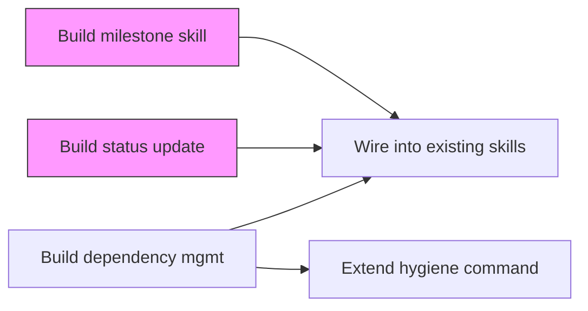
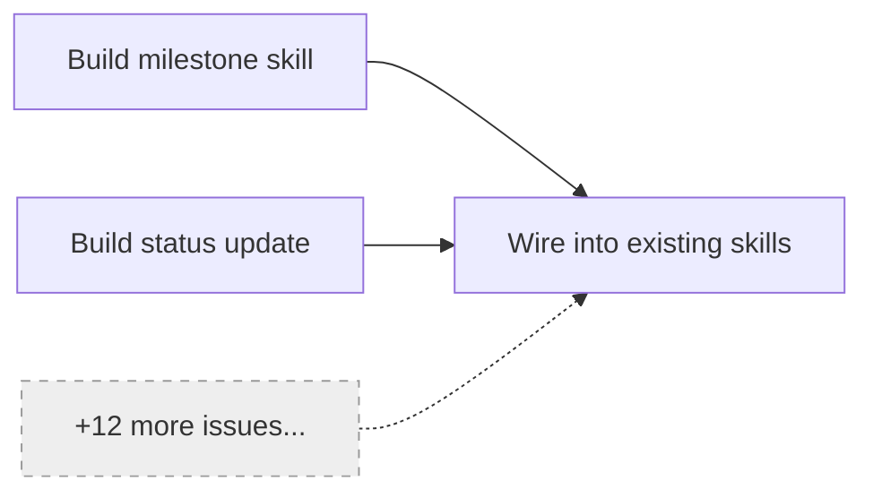

# Dependency Management

Manage issue dependency relations safely. This skill provides dependency detection, relation creation/removal, visualization, and auto-linking for decomposed sub-issues.

**Key discovery:** The Linear MCP's `create_issue` and `update_issue` support `blocks`, `blockedBy`, and `relatedTo` parameters natively. GraphQL is NOT required for basic relation management. GraphQL fallback is only needed for advanced cases (relation deletion, relation type changes).

---

## !! CRITICAL SAFETY RULE — READ THIS FIRST !!

### The DO NOT Rule (C1): `update_issue` REPLACES Relation Arrays

> **`update_issue` `blocks`/`blockedBy`/`relatedTo` parameters REPLACE the entire existing array. They do NOT append.**
>
> Calling `update_issue(blocks: ["CIA-456"])` on an issue that already blocks `CIA-123` and `CIA-789` will **DESTROY** those existing relations, leaving only `CIA-456`.
>
> **This is the most dangerous operation in the entire Linear MCP integration.**

### Mandatory Protocol: `safeUpdateRelations`

**Every** relation modification MUST use the `safeUpdateRelations` wrapper below. Direct `update_issue` calls with `blocks`, `blockedBy`, or `relatedTo` parameters are **PROHIBITED** outside this wrapper.

```
safeUpdateRelations(issueId, relationType, newRelationIds, operation)
```

**Parameters:**
- `issueId`: The issue to modify (e.g., `"CIA-539"`)
- `relationType`: One of `"blocks"`, `"blockedBy"`, `"relatedTo"`
- `newRelationIds`: Array of issue IDs to add or remove
- `operation`: `"add"` (default) or `"remove"`

**Steps (read-merge-write):**

```
1. READ:  get_issue(issueId, includeRelations: true)
2. EXTRACT: current = response.relations[relationType].map(r => r.identifier)
3. MERGE:
   - If operation == "add":    merged = deduplicate(current + newRelationIds)
   - If operation == "remove": merged = current.filter(id => !newRelationIds.includes(id))
4. VALIDATE: Confirm merged array is correct (log both current and merged for audit)
5. WRITE:  update_issue(id: issueId, [relationType]: merged)
```

**Example — Adding a blocks relation:**

```
# WRONG — destroys existing relations
update_issue(id: "CIA-539", blocks: ["CIA-456"])

# CORRECT — preserves existing relations
1. get_issue("CIA-539", includeRelations: true)
   → relations.blocks = [{identifier: "CIA-540"}, {identifier: "CIA-541"}]
2. current = ["CIA-540", "CIA-541"]
3. merged = ["CIA-540", "CIA-541", "CIA-456"]
4. update_issue(id: "CIA-539", blocks: ["CIA-540", "CIA-541", "CIA-456"])
```

**Example — Removing a blocks relation:**

```
1. get_issue("CIA-539", includeRelations: true)
   → relations.blocks = [{identifier: "CIA-540"}, {identifier: "CIA-541"}]
2. current = ["CIA-540", "CIA-541"]
3. merged = ["CIA-541"]  // removed CIA-540
4. update_issue(id: "CIA-539", blocks: ["CIA-541"])
```

**Failure modes the wrapper prevents:**
- Orphaned issues that were previously linked
- Silent data loss when adding a single relation overwrites many
- Race conditions when multiple agents modify the same issue

### Enforcement

Any code path that modifies relations MUST go through `safeUpdateRelations`. This includes:
- Manual `--add` / `--remove` commands
- Auto-relation during `/ccc:decompose`
- Bulk relation operations
- Any future skill that touches dependency links

---

## Input Validation (C2)

All issue ID inputs MUST be validated before any operation — especially before shell execution (GraphQL fallback).

**Accepted formats:**

| Format | Regex | Example |
|--------|-------|---------|
| Linear identifier | `/^[A-Z]+-\d+$/` | `CIA-539`, `PROJ-42` |
| UUID | `/^[a-f0-9-]+$/` | `bf865975-fc57-42ba-ba55-db9f0421b552` |

**Validation protocol:**

```
function validateIssueId(input):
  if input matches /^[A-Z]+-\d+$/: return { valid: true, format: "identifier" }
  if input matches /^[a-f0-9-]+$/: return { valid: true, format: "uuid" }
  return { valid: false, error: "Invalid issue ID format: must be 'ABC-123' or UUID" }
```

**Reject immediately** if validation fails. Never pass unvalidated input to:
- Shell commands (GraphQL `curl`/`node` invocations)
- `get_issue` or `update_issue` calls
- Any string interpolation in queries

This prevents command injection via malicious issue ID inputs.

---

## Confirmation Protocol (C3)

All relation modifications require user confirmation before execution.

| Operation | Confirmation Required | Bypass with `--yes` |
|-----------|:--------------------:|:-------------------:|
| `--add` (single relation) | YES — show proposed change | YES |
| `--detect` (accept suggestions) | YES — show all proposed relations | YES |
| `--remove` (single relation) | ALWAYS — show what will be removed | YES |
| Auto-relation on decompose | YES — summary table, single prompt | YES |
| `--milestone` (read-only viz) | NO | N/A |
| View single issue deps | NO | N/A |

**Confirmation format:**

```
Proposed change:
  CIA-123 --[blocks]--> CIA-456

Current relations for CIA-123:
  blocks: CIA-789, CIA-790
  blockedBy: (none)

After change:
  blocks: CIA-789, CIA-790, CIA-456

Proceed? [y/N]
```

For bulk operations (decompose auto-relations):

```
Proposed relations (4 total):
| Source  | Relation | Target  |
|---------|----------|---------|
| CIA-101 | blocks   | CIA-102 |
| CIA-102 | blocks   | CIA-103 |
| CIA-102 | blocks   | CIA-104 |
| CIA-103 | blocks   | CIA-105 |

Create all 4 relations? [y/N]
```

Use `AskUserQuestion` for confirmation in interactive mode. The `--yes` flag skips confirmation for automation and scripting use cases.

---

## Dependency Detection (Shared Utility) (I2, I3)

### Detection Function: `detectDependencies`

A shared utility function that scans issue descriptions for dependency signals. This function is the single source of truth for dependency detection — both `planning-preflight` and `dependency-management` call this same function.

```
detectDependencies(description, knownIssueIds) -> DependencySignal[]
```

**Parameters:**
- `description`: The issue description text to scan
- `knownIssueIds`: Array of issue identifiers in the current project/milestone (for cross-referencing)

**Returns:** Array of `DependencySignal` objects:

```
{
  type: "blocks" | "blockedBy" | "relatedTo",
  targetId: string | null,      // Explicit issue ID if found
  signal: string,                // The matched phrase
  confidence: "high" | "medium" | "low",
  source: "explicit" | "inferred"
}
```

**Signal patterns (ordered by confidence):**

| Pattern | Type | Confidence | Source |
|---------|------|-----------|--------|
| `"blocks CIA-123"`, `"blocking CIA-123"` | blocks | high | explicit |
| `"blocked by CIA-123"`, `"depends on CIA-123"` | blockedBy | high | explicit |
| `"related to CIA-123"`, `"see also CIA-123"` | relatedTo | high | explicit |
| `"requires CIA-123"`, `"needs CIA-123 first"` | blockedBy | high | explicit |
| `"after CIA-123 is complete"` | blockedBy | high | explicit |
| `"depends on [description]"` (no ID) | blockedBy | medium | inferred |
| `"requires [description]"` (no ID) | blockedBy | medium | inferred |
| `"blocked by [description]"` (no ID) | blockedBy | medium | inferred |
| `"before we can [description]"` | blocks | low | inferred |
| `"prerequisite: [description]"` | blockedBy | medium | inferred |

**Regex for explicit ID extraction:**

```regex
/(?:blocks?|blocking|blocked\s+by|depends?\s+on|requires?|needs?|related\s+to|see\s+also|after)\s+([A-Z]+-\d+)/gi
```

**Cross-referencing:** When a signal mentions a description but no ID, attempt to match against `knownIssueIds` by fuzzy title matching. If a match scores >70% similarity, upgrade the signal to `source: "explicit"` with the matched ID.

### Delegation from planning-preflight (I3)

The `planning-preflight` skill delegates dependency detection to this skill's `detectDependencies` function. The integration point is:

- **Planning-preflight Step 2c** (keyword overlap detection): After gathering sibling issues, pass each issue's description through `detectDependencies` with the sibling issue IDs as `knownIssueIds`.
- **Planning-preflight Step 2d** (classification): Use the `DependencySignal.type` to populate the BLOCKS / BLOCKED-BY classifications in the overlap table.

This replaces any inline dependency detection in planning-preflight. The preflight skill should reference this skill's utility rather than duplicating the signal patterns.

---

## Relation Creation — Unified Interface (I5)

Abstract MCP-native and GraphQL behind a single interface. The caller never needs to know which backend is used.

### `createRelation(sourceId, relationType, targetId, options)`

**Parameters:**
- `sourceId`: Source issue identifier (validated via C2)
- `relationType`: `"blocks"` | `"blockedBy"` | `"relatedTo"` | `"duplicateOf"`
- `targetId`: Target issue identifier (validated via C2)
- `options`: `{ verbose: boolean }` (default: `{ verbose: false }`)

**Execution strategy:**

```
1. Validate sourceId and targetId (C2)
2. Confirm with user (C3) — skip if --yes
3. If relationType in ["blocks", "blockedBy", "relatedTo"]:
     → Use safeUpdateRelations (MCP-native, primary path)
4. If relationType == "duplicateOf":
     → Use update_issue(id: sourceId, duplicateOf: targetId)
5. On MCP failure:
     → Fall back to GraphQL issueRelationCreate (see references/graphql-relations.md)
     → Log: "MCP failed, using GraphQL fallback" (verbose mode only)
6. On success: Return { success: true, method: "mcp" | "graphql" }
7. On failure: Return { success: false, error: "Relation creation failed" }
   → In verbose mode: include backend-specific error details
```

### `removeRelation(sourceId, relationType, targetId, options)`

**Parameters:** Same as `createRelation`.

**Execution strategy:**

```
1. Validate sourceId and targetId (C2)
2. Confirm with user (C3) — ALWAYS confirm for remove
3. If relationType in ["blocks", "blockedBy", "relatedTo"]:
     → Use safeUpdateRelations with operation: "remove"
4. If safeUpdateRelations insufficient (e.g., need to remove duplicateOf):
     → Fall back to GraphQL issueRelationDelete
5. User-facing errors: "Relation removal failed" (verbose: include details)
```

**Error display (I5):**
- Normal mode: `"Failed to add dependency: CIA-123 blocks CIA-456. Relation creation failed."`
- Verbose mode: `"Failed to add dependency: CIA-123 blocks CIA-456. GraphQL error: issueRelationCreate returned 'Issue not found' (404). Check that both issue IDs exist."`

---

## Auto-Relation on Decompose

When `/ccc:decompose` creates sub-issues from a parent, this skill auto-creates `blocks` relations for sequential tasks on the critical path.

### Protocol

```
1. Receive the ordered list of sub-issues from decompose
2. Identify sequential dependencies:
   - Tasks explicitly marked as sequential in the decomposition
   - Tasks where the description references a prior task's output
3. Build proposed relations:
   - For each sequential pair: earlier_task blocks later_task
4. Present summary table to user (C3 confirmation protocol)
5. On confirmation: execute each relation via safeUpdateRelations
6. Skip relations for tasks marked as parallelizable
```

**Example:**

```
Decompose created 4 sub-issues for CIA-500:
  CIA-501: Set up database schema
  CIA-502: Build API endpoints (depends on schema)
  CIA-503: Build UI components (parallel with API)
  CIA-504: Integration tests (depends on API + UI)

Proposed auto-relations:
| Source  | Relation | Target  | Reason |
|---------|----------|---------|--------|
| CIA-501 | blocks   | CIA-502 | Sequential: API needs schema |
| CIA-502 | blocks   | CIA-504 | Sequential: tests need API |
| CIA-503 | blocks   | CIA-504 | Sequential: tests need UI |

CIA-501 and CIA-503 have no relation (parallelizable).
```

---

## Visualization (I4)

Generate on-demand mermaid dependency graphs for a milestone or issue.

### Scale Limits

| Condition | Behavior |
|-----------|----------|
| <= 30 issues | Full graph — all nodes and edges |
| > 30 issues | Truncated — top-level + first-hop dependencies, `[+N more]` nodes |
| `--full` flag | Override limit — render complete graph regardless of size |

### Graph Generation

```
1. Fetch all issues in the milestone (or single issue + its relations)
2. For each issue, get_issue(includeRelations: true)
3. Build adjacency list from blocks/blockedBy relations
4. If node count > 30 AND --full not set:
   a. Identify root nodes (no incoming edges)
   b. Include root nodes + first-hop neighbors
   c. For remaining nodes, add a single "[+N more]" placeholder node
5. Generate mermaid graph LR syntax
6. Apply styling:
   - Done issues: green fill
   - In Progress: yellow fill
   - Blocked: red border
   - Todo/Backlog: default
```

**Output format:**



**Truncated output (>30 nodes, no `--full`):**



---

## Credential Safety (I6)

GraphQL shell commands MUST use the `$LINEAR_AGENT_TOKEN` environment variable. This token is stored in macOS Keychain under `claude/linear-agent-token`.

**Rules:**
- Always reference `$LINEAR_AGENT_TOKEN` — never hardcode or inline tokens
- Never log token values (even in verbose mode)
- Never include tokens in error messages
- Shell commands: `'Authorization': process.env.LINEAR_AGENT_TOKEN` (not string interpolation)

See `references/graphql-relations.md` for correctly-formatted examples.

---

## Integration Points

| Skill/Command | Integration |
|---------------|-------------|
| `planning-preflight` | Delegates to `detectDependencies` utility (I3). Preflight Step 2c/2d uses this skill's detection logic. |
| `/ccc:decompose` | Calls auto-relation protocol after creating sub-issues. Uses `safeUpdateRelations`. |
| `/ccc:deps` | Command interface — routes to this skill's functions. See `commands/deps.md`. |
| `/ccc:go --next` | Reads dependency graph to find unblocked tasks. Consumes relation data created by this skill. |
| `/ccc:hygiene` | CIA-541 will extend hygiene to audit dependency health. Consumes relation data. |
