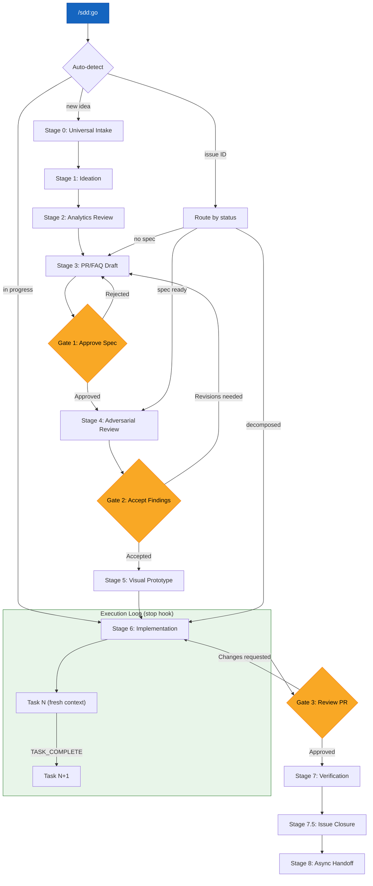
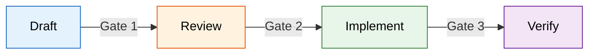

# Spec-Driven Development Workflow

This is the complete funnel from idea to production. Every feature, fix, and infrastructure change flows through these stages. The funnel enforces three human approval gates and eliminates ambiguity about what is being built, why, and when it is done.

## Funnel Overview



## Unified Entry Point: `/sdd:go`

The `/sdd:go` command is the recommended way to interact with the funnel. It auto-detects your context and routes to the correct stage. All existing commands remain directly invocable (dual access model).

```
/sdd:go [argument] [--quick] [--mode MODE] [--status] [--next]
```

| Argument | Behavior |
|----------|----------|
| (none) | Check for active work, resume or ask what to build |
| `--status` | Show "You Are Here" text-based funnel view |
| `CIA-XXX` | Route by issue status to correct stage |
| `"free text"` | New idea → intake → spec draft |
| `--quick` | Collapse funnel for small tasks |
| `--next` | Pick up next unblocked task |

See the `/sdd:go` command definition and the **execution-engine** skill for full details.

## Fast Paths

Not every task needs the full 9-stage funnel. The execution mode determines which stages to skip:

| Execution Mode | Stages Used | Stages Skipped | Typical Use |
|---------------|-------------|----------------|-------------|
| `quick` | 0, 3 (quick template), 6, 7, 7.5 | 1, 2, 4, 5, 8 | Bug fixes, small features, config changes |
| `tdd` | 0, 3, 6, 7, 7.5 | 2, 4, 5, 8 | Well-defined features with clear acceptance criteria |
| `pair` | 0, 1, 3, 4, 6, 7, 7.5 | 2, 5, 8 | Uncertain scope requiring human-in-the-loop |
| `checkpoint` | All stages | None | High-risk changes, infrastructure, breaking changes |
| `swarm` | 0, 3, 4, 6, 7, 7.5 | 2, 5, 8 | Large scope decomposed into parallel subtasks |

**Rule of thumb:** If the task can be described in one sentence and has an obvious implementation, use `quick` and skip to Stage 6 after intake. The full funnel is the maximum envelope, not the minimum ceremony.

## Stage Reference

| # | Stage | Environment | Key Tools | Gate |
|---|-------|-------------|-----------|------|
| 0 | Universal Intake | Any surface | ~~project-tracker~~ | None (normalization) |
| 1 | Ideation | Collaborative session / chat | ~~project-tracker~~ MCP | None |
| 2 | Analytics Review | Coding tool | ~~analytics-platform~~ | None (informational) |
| 3 | PR/FAQ Draft | Collaborative session | PR/FAQ templates, ~~project-tracker~~ MCP | **Human: approve spec** |
| 4 | Adversarial Review | ~~ci-cd~~ | Review options A-D | **Human: accept findings** |
| 5 | Visual Prototype | ~~design-tool~~ | ~~version-control~~ integration | None (skip for non-UI) |
| 6 | Implementation | Coding tool | Subagents, model mixing | **Human: review PR** |
| 7 | Verification | ~~deployment-platform~~ | Preview deploy, analytics check | Merge to production |
| 7.5 | Issue Closure | Coding tool + ~~project-tracker~~ | Metadata-driven closure rules | Auto/propose per rules |
| 8 | Async Handoff | ~~remote-execution~~ | Remote dispatch | N/A |

## Stage 0: Universal Intake

All ideas, regardless of origin, must reach a ~~project-tracker~~ issue to enter the funnel. Nothing is worked on until it has an issue. Nothing has an issue until it has been normalized through intake.

### 4 Intake Surfaces

| Surface | Example | Normalization |
|---------|---------|---------------|
| Collaborative session (e.g., Claude Cowork) | "What if we added X?" | Capture as draft issue during session |
| Code session discovery | "This module needs refactoring" | Create issue with `source:code-session` label |
| Voice memo | Transcribed idea | Create issue with `source:voice` label |
| Direct creation | Deliberately filed issue | Create issue with `source:direct` label |

**Normalization rules:**
- Every issue gets a source label indicating its origin
- Every issue gets assigned to a project (no orphan issues)
- Every issue gets a one-sentence title that describes the outcome, not the task
- Duplicate detection: before creating, search existing issues for overlapping scope. If found, add as a comment to the existing issue instead of creating a new one.

## Stage 1: Ideation

Expand the intake issue into something that can be specced. This stage is exploratory -- the goal is to determine whether the idea is worth investing in a full PR/FAQ.

**Activities:**
- Discuss the problem space (collaborative session or chat)
- Identify who cares about this and why
- Check if prior art exists (~~research-library~~ semantic search, existing codebase)
- Estimate rough scope: is this a quick fix or a multi-sprint effort?

**Output:** The issue description is updated with enough context to draft a PR/FAQ. If the idea is not worth pursuing, the issue is closed with a rationale.

## Stage 2: Analytics Review

Before speccing a solution, check what the data says. This stage is informational -- it does not have a gate, but its findings feed into the PR/FAQ.

**Activities:**
- Review relevant ~~analytics-platform~~ dashboards for usage patterns
- Check error rates, performance metrics, or user behavior data related to the problem
- Identify any quantitative evidence that supports or contradicts the proposed solution

**Output:** A brief data summary appended to the issue. Even "no relevant data available" is a valid output -- it tells you the spec will be based on qualitative reasoning.

**Skip condition:** Skip for infrastructure changes or features with no existing user-facing surface to measure.

## Stage 3: PR/FAQ Draft

Write the spec using the PR/FAQ methodology. This is where the real thinking happens. See the **prfaq-methodology** skill for the full process.

**Activities:**
- Select the appropriate template (`prfaq-feature`, `prfaq-research`, `prfaq-infra`, `prfaq-quick`)
- Draft interactively using the question-by-question process
- Add spec frontmatter with ~~project-tracker~~ issue link, execution mode, and status
- Set `status: draft` and update the ~~project-tracker~~ issue label to `spec:draft`

**Output:** A complete PR/FAQ document committed to `docs/specs/` in the ~~version-control~~ repository, or stored in the ~~project-tracker~~ issue description for `prfaq-quick` specs.

### Gate 1: Approve Spec

**Who:** Human (spec author or stakeholder)
**Decision:** Is this spec clear enough and valuable enough to invest in review and implementation?
**On approval:** `spec:draft` --> `spec:ready`
**On rejection:** Return to Stage 3 with feedback. Issue remains `spec:draft`.

## Stage 4: Adversarial Review

Subject the approved spec to structured adversarial review. See the **adversarial-review** skill for the full methodology and architecture options.

**Activities:**
- Trigger review via the selected architecture option (A, B, C, or D)
- Three reviewer perspectives (Challenger, Security Reviewer, Devil's Advocate) analyze the spec
- Synthesizer consolidates findings into Critical / Important / Consider categories
- Review output is posted as a ~~version-control~~ PR comment or ~~project-tracker~~ issue comment

**Output:** A structured review with a recommendation (APPROVE, REVISE, or RETHINK).

### Gate 2: Accept Findings

**Who:** Human (spec author)
**Decision:** Are the review findings acceptable? Do any Critical items need to be addressed first?
**On acceptance:** Proceed to Stage 5 (or Stage 6 if non-UI). Update label to `spec:review`.
**On REVISE:** Return to Stage 3 to address Critical and Important findings.
**On RETHINK:** Return to Stage 1 to reconsider the fundamental approach.

## Stage 5: Visual Prototype

For UI features, create a visual prototype before writing implementation code. This catches design issues early when they are cheap to fix.

**Activities:**
- Build a prototype in ~~design-tool~~ based on the spec
- Review the prototype against acceptance criteria
- Commit design assets or prototype links to the ~~version-control~~ repository

**Skip conditions:**
- Backend-only features, infrastructure changes, API-only work, or any non-UI scope
- Fix or refactor of existing UI where the visual design is not changing (e.g., bug fixes, accessibility improvements, responsive adjustments, component refactoring)
- Changes where the UI surface already exists and the work is modifying behavior, not appearance

When skipped, proceed directly to Stage 6.

**Output:** A reviewable prototype linked from the spec.

## Stage 6: Implementation

Write the code. The execution mode (from the spec frontmatter) determines how implementation proceeds. See the **execution-modes** skill for details.

**Activities:**
- Create a feature branch from the spec
- Implement according to the selected execution mode:
  - `quick` -- Direct implementation
  - `tdd` -- Red-green-refactor cycle
  - `pair` -- Plan Mode with human-in-the-loop
  - `checkpoint` -- Pause at milestones for review
  - `swarm` -- Parallel subagents for independent subtasks
- Update the ~~project-tracker~~ issue to `spec:implementing`
- Model mixing for subagents: fast models for scanning and linting, strong models for architecture and complex logic
- Open a pull request when implementation is complete

**Output:** A pull request with passing tests and a description that references the spec.

### Gate 3: Review PR

**Who:** Human (code reviewer)
**Decision:** Does the implementation match the spec? Are there quality, security, or performance concerns?
**On approval:** Merge and proceed to Stage 7.
**On changes requested:** Return to Stage 6 to address feedback.

## Stage 7: Verification

After merge, verify the feature works in a production-like environment.

**Activities:**
- ~~deployment-platform~~ creates a preview deployment (or production deployment on merge)
- Run smoke tests against the deployed feature
- Check ~~analytics-platform~~ for any anomalies introduced by the change
- Verify acceptance criteria from the spec against the live deployment
- If using Vercel: check preview deployment URL from the PR comment, use Vercel Toolbar for visual inspection, verify environment variables are correctly set for preview vs production

**Verification checklist pattern:**
- Build succeeds (typecheck, lint, tests pass in CI)
- Preview deployment is accessible and functional
- Acceptance criteria from spec are met on the deployed preview
- No regressions in existing functionality (manual spot-check or automated E2E)
- Production deployment (after merge) matches preview behavior

**Output:** Verified deployment. Feature is live.

## Stage 7.5: Issue Closure

After verification, close the loop on ~~project-tracker~~ issues. This stage has specific rules to prevent premature or incorrect closure. See the **issue-lifecycle** skill for the full closure protocol.

**Three closure modes:**

| Mode | Condition | Action |
|------|-----------|--------|
| AUTO-CLOSE | Agent-assigned issue + single PR + merged + deploy passing | Close automatically with evidence |
| PROPOSE | All other completed issues | Comment with evidence, request human confirmation |
| NEVER | Human-assigned issues or `needs:human-decision` label | Never auto-close; always propose |

**Evidence required for closure:**
- Link to merged PR
- Link to passing deployment or verification
- Confirmation that acceptance criteria from the spec are met

**Label update:** `spec:implementing` --> `spec:complete` on closure.

## Stage 8: Async Handoff

For work that continues beyond the current session or requires remote execution.

**Activities:**
- Dispatch remaining tasks to ~~remote-execution~~ agents
- Write a handoff document summarizing: what was done, what remains, and any blockers
- Update the ~~project-tracker~~ issue with handoff notes

**Output:** A clean handoff that allows another session or agent to pick up where this one left off.

## Approval Gates Summary

The three gates are the only points where human judgment is required. Everything else can be automated or agent-driven.



1. **Approve spec** (Stage 3 exit) -- Confirms the problem is worth solving and the approach is sound.
2. **Accept review findings** (Stage 4 exit) -- Confirms the spec survives adversarial scrutiny.
3. **Review PR** (Stage 6 exit) -- Confirms the implementation matches the spec.

Everything before Gate 1 is exploration. Everything between Gate 1 and Gate 3 is execution. Everything after Gate 3 is verification.

## Stage Transitions and Labels

The ~~project-tracker~~ labels track where an issue is in the funnel:

| Label | Meaning | Set When |
|-------|---------|----------|
| `spec:draft` | PR/FAQ written, awaiting approval | Stage 3 complete |
| `spec:ready` | Spec approved, ready for review | Gate 1 passed |
| `spec:review` | Under adversarial review | Stage 4 in progress |
| `spec:implementing` | Code is being written | Stage 6 in progress |
| `spec:complete` | Shipped and verified | Stage 7.5 closure |

## Master Plan Pattern

When batched or sequential work spans 2+ sessions, create a **master session plan issue** in the project tracker. This is the tracking artifact that keeps multi-session work visible and accountable.

**Structure:**
- The master issue has sub-issues for each session or step in the plan
- The plan file (stored locally, e.g., `~/.claude/plans/`) is the execution blueprint; the project tracker issue is the tracking artifact that others can follow
- Sub-issues are created upfront during planning, not discovered during execution

**Two-session gate:**
- **Session 1** = decisions, research, and planning. Produce recommendations, not changes.
- **Human review gate** between sessions. The human reviews Session 1 output before Session 2 begins.
- **Session 2** = execution. Apply the decisions made and approved in Session 1.

**Why separate sessions:** Never mix research/decisions and execution in the same session. Empirically, combining both leads to >70% context consumption (compaction risk), rushed decisions late in the session, and execution that outpaces approval. The two-session gate forces deliberate pacing.

**When to use:** Any task that requires both "figuring out what to do" and "doing it" across more than a trivial scope. If the research phase alone could consume >30% of context, split into sessions.

## Scope Discipline

Scope creep is the primary risk to session success. These rules enforce predictable execution.

**Pilot batch before bulk operations:**
- When a task affects 10+ items (issues, files, database records, etc.), do a pilot batch of 3-5 first
- Verify results with the human or against expected outcomes
- Then proceed with the remainder
- This catches systematic errors early when they are cheap to fix, not after 50 items are modified

**Approach confirmation:**
- Before executing a plan that touches >5 files or >10 issues, explicitly confirm the approach with the human
- Even if the overall plan is approved, the first batch serves as validation of the specific implementation approach
- "The plan is right" and "my execution of the plan is right" are two different claims

**Scope creep guard:**
- If during execution you discover new work, create a sub-issue immediately
- NEVER add scope to the parent issue or the current session plan
- Document the discovery, link it to the parent, and move on
- The new work enters the funnel at Stage 0 like everything else

**Anti-pattern: "while I'm here":**
- Resist the temptation to fix adjacent issues discovered during implementation
- Log them as new issues with appropriate context, do not fix them in the current session
- Adjacent fixes bypass the spec and review gates, introducing unreviewed changes
- The only exception is trivially mechanical fixes (e.g., a typo on the same line you are editing) that require zero judgment

## Human Review Gates

The three approval gates (Stage 3, Stage 4, Stage 6) are structural requirements, not suggestions. They exist because agent-driven work can move faster than human comprehension of what changed.

**Gate enforcement:**
- No gate can be skipped, even for `quick` execution mode (which still requires Gate 3: PR review)
- Gates are synchronization points: the agent stops, the human catches up, then work resumes
- Passing a gate is an explicit human action (approval comment, PR approval, etc.), never implicit

**Architectural decisions require split sessions:**
- Any change that alters system architecture, data models, or cross-cutting concerns must be split into "propose" and "execute" sessions
- Session 1 produces a proposal (ADR, spec update, or recommendation document)
- Human review between sessions is NOT optional -- it is a structural requirement
- Session 2 executes only what was explicitly approved

**Evidence format for review:**
- Present findings as a summary table, not raw data dumps
- Link to project tracker issues for traceability
- Include an explicit recommendation (approve, revise, reject, or defer)
- Keep the review surface small: the human should be able to make a decision in under 5 minutes of reading
- Never dump evidence tables, audit findings, or spec content into issue comments -- use documents or linked files instead

## Cross-Skill References

This workflow integrates with the other skills in this plugin:

- **execution-engine** -- Powers Stage 6 (stop hook task loop, `.sdd-state.json`, `.sdd-progress.md`, gate pauses, retry budget)
- **prfaq-methodology** -- Governs Stage 3 (PR/FAQ drafting process, templates, interactive questioning)
- **adversarial-review** -- Governs Stage 4 (reviewer perspectives, architecture options A-D)
- **execution-modes** -- Governs Stage 6 (quick, tdd, pair, checkpoint, swarm routing)
- **issue-lifecycle** -- Governs Stage 7.5 (closure rules, evidence requirements, ownership boundaries)
- **context-management** -- Applies across all stages (subagent delegation, output brevity, model mixing)
