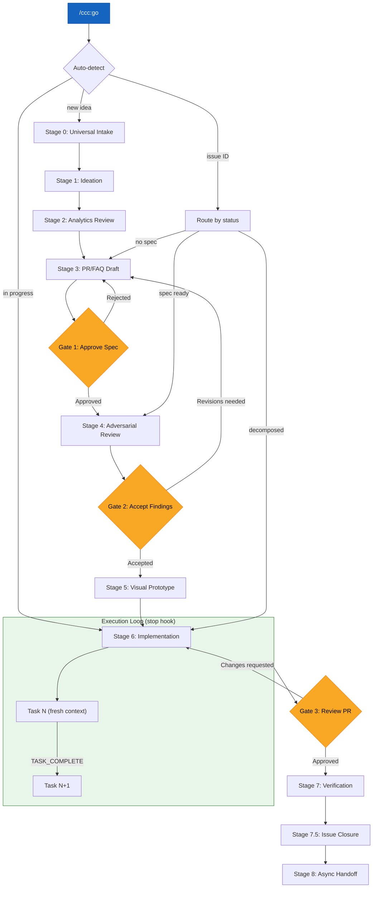
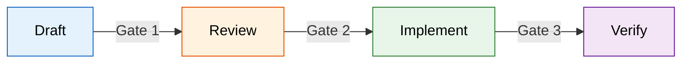

# Stage Details

Detailed descriptions for each stage of the spec-driven development funnel. The parent SKILL.md contains the overview, fast paths, and gate descriptions. This file has the full stage-by-stage breakdown.

## Funnel Diagram

## Approval Gates Diagram

## Stage 0: Universal Intake

All ideas, regardless of origin, must reach a ~~project-tracker~~ issue to enter the funnel. Nothing is worked on until it has an issue. Nothing has an issue until it has been normalized through intake.

### 4 Intake Surfaces

| Surface | Example | Normalization |
|---------|---------|---------------|
| Collaborative session (e.g., Claude Cowork) | "What if we added X?" | Capture as draft issue during session |
| Code session discovery | "This module needs refactoring" | Create issue with `source:code-session` label |
| Voice memo | Transcribed idea | Create issue with `source:voice` label |
| Direct creation | Deliberately filed issue | Create issue with `source:direct` label |

**Normalization rules:**
- Every issue gets a source label indicating its origin
- Every issue gets assigned to a project (no orphan issues)
- Every issue gets a one-sentence title that describes the outcome, not the task
- Duplicate detection: before creating, search existing issues for overlapping scope. If found, add as a comment to the existing issue instead of creating a new one.

## Stage 1: Ideation

Expand the intake issue into something that can be specced. This stage is exploratory -- the goal is to determine whether the idea is worth investing in a full PR/FAQ.

**Activities:**
- Discuss the problem space (collaborative session or chat)
- Identify who cares about this and why
- Check if prior art exists (~~research-library~~ semantic search, existing codebase)
- Estimate rough scope: is this a quick fix or a multi-sprint effort?

**Output:** The issue description is updated with enough context to draft a PR/FAQ. If the idea is not worth pursuing, the issue is closed with a rationale.

## Stage 2: Analytics Review

Before speccing a solution, check what the data says. This stage is informational -- it does not have a gate, but its findings feed into the PR/FAQ.

**Activities:**
- Review relevant ~~analytics-platform~~ dashboards for usage patterns
- Check error rates, performance metrics, or user behavior data related to the problem
- Identify any quantitative evidence that supports or contradicts the proposed solution

**Output:** A brief data summary appended to the issue. Even "no relevant data available" is a valid output -- it tells you the spec will be based on qualitative reasoning.

**Skip condition:** Skip for infrastructure changes or features with no existing user-facing surface to measure.

## Stage 3: PR/FAQ Draft

Write the spec using the PR/FAQ methodology. This is where the real thinking happens. See the **prfaq-methodology** skill for the full process.

**Activities:**
- Select the appropriate template (`prfaq-feature`, `prfaq-research`, `prfaq-infra`, `prfaq-quick`)
- Draft interactively using the question-by-question process
- Add spec frontmatter with ~~project-tracker~~ issue link, execution mode, and status
- Set `status: draft` and update the ~~project-tracker~~ issue label to `spec:draft`

**Output:** A complete PR/FAQ document committed to `docs/specs/` in the ~~version-control~~ repository, or stored in the ~~project-tracker~~ issue description for `prfaq-quick` specs.

## Stage 4: Adversarial Review

Subject the approved spec to structured adversarial review. See the **adversarial-review** skill for the full methodology and architecture options.

**Activities:**
- Trigger review via the selected architecture option (A, B, C, or D)
- Three reviewer perspectives (Challenger, Security Reviewer, Devil's Advocate) analyze the spec
- Synthesizer consolidates findings into Critical / Important / Consider categories
- Review output is posted as a ~~version-control~~ PR comment or ~~project-tracker~~ issue comment

**Output:** A structured review with a recommendation (APPROVE, REVISE, or RETHINK).

## Stage 5: Visual Prototype

For UI features, create a visual prototype before writing implementation code. This catches design issues early when they are cheap to fix.

**Activities:**
- Build a prototype using the appropriate design tool (see routing table below) based on the spec
- Review the prototype against acceptance criteria
- Commit design assets or prototype links to the version-control repository
- Attach prototype evidence (screenshot, URL, or .pen file path) to the Linear issue

### Design Tool Routing

| Tool | Surface | Use When | MCP/Access |
|------|---------|----------|------------|
| **v0** | Claude Code | Generating new UI components, page layouts, or React prototypes from spec descriptions | Project-level MCP (`v0`) |
| **Figma** | Cowork / Desktop | High-fidelity mockups, design system compliance checks, handoff to implementation with exact measurements | OAuth Connector (Desktop only) |
| **Pencil MCP** | Claude Code | Inspecting or editing `.pen` design files, validating against design system variables, batch design operations | `mcp__pencil__*` (13 tools, deferred) |
| **Magic Patterns** | Manual | Rapid UI pattern exploration when v0 is unavailable or you need alternative design directions | Via LiteLLM proxy (`localhost:4000`) |
| **visual-documentation-skills** | Claude Code | Architecture diagrams, flowcharts, system overviews — NOT for UI prototyping | Plugin skill (SVG output) |

**Tool selection rule:** v0 for component generation (most common). Figma for pixel-perfect design work requiring a design system. Pencil for .pen file workflows. Magic Patterns as an overflow/exploration tool. `visual-documentation-skills` is for architecture diagrams only — never route UI prototyping there.

### Stage 5 → Stage 6 Handoff Protocol

1. **Prototype output** is attached to the Linear issue as one of: v0 shareable URL, Figma file link, .pen file path, or screenshot
2. **Implementation notes** are added to the issue: component hierarchy, key dimensions, responsive breakpoints, interaction states
3. **Acceptance criteria update:** If the prototype reveals design decisions not captured in the original spec ACs, add them before moving to Stage 6
4. **Design tokens:** If the prototype uses design system variables (Pencil) or Figma tokens, document the variable names for the implementer

When the prototype is approved (or self-approved for `quick` mode), proceed to Stage 6.

**Skip conditions:**
- Backend-only features, infrastructure changes, API-only work, or any non-UI scope
- Fix or refactor of existing UI where the visual design is not changing (e.g., bug fixes, accessibility improvements, responsive adjustments, component refactoring)
- Changes where the UI surface already exists and the work is modifying behavior, not appearance

When skipped, proceed directly to Stage 6.

**Output:** A reviewable prototype linked from the spec, with implementation notes attached to the Linear issue.

## Stage 6: Implementation

Write the code. The execution mode (from the spec frontmatter) determines how implementation proceeds. See the **execution-modes** skill for details.

**Activities:**
- Create a feature branch from the spec
- Implement according to the selected execution mode:
  - `quick` -- Direct implementation
  - `tdd` -- Red-green-refactor cycle
  - `pair` -- Plan Mode with human-in-the-loop
  - `checkpoint` -- Pause at milestones for review
  - `swarm` -- Parallel subagents for independent subtasks
- Update the ~~project-tracker~~ issue to `spec:implementing`
- Model mixing for subagents: fast models for scanning and linting, strong models for architecture and complex logic
- Open a pull request when implementation is complete

**Output:** A pull request with passing tests and a description that references the spec.

## Stage 7: Verification

After merge, verify the feature works in a production-like environment.

**Activities:**
- ~~deployment-platform~~ creates a preview deployment (or production deployment on merge)
- Run smoke tests against the deployed feature
- Check ~~analytics-platform~~ for any anomalies introduced by the change
- Verify acceptance criteria from the spec against the live deployment
- If using Vercel: check preview deployment URL from the PR comment, use Vercel Toolbar for visual inspection, verify environment variables are correctly set for preview vs production

**Verification checklist pattern:**
- Build succeeds (typecheck, lint, tests pass in CI)
- Preview deployment is accessible and functional
- Acceptance criteria from spec are met on the deployed preview
- No regressions in existing functionality (manual spot-check or automated E2E)
- Production deployment (after merge) matches preview behavior

**Output:** Verified deployment. Feature is live.

## Stage 7.5: Issue Closure

After verification, close the loop on ~~project-tracker~~ issues. This stage has specific rules to prevent premature or incorrect closure. See the **issue-lifecycle** skill for the full closure protocol.

**Three closure modes:**

| Mode | Condition | Action |
|------|-----------|--------|
| AUTO-CLOSE | Agent-assigned issue + single PR + merged + deploy passing | Close automatically with evidence |
| PROPOSE | All other completed issues | Comment with evidence, request human confirmation |
| NEVER | Human-assigned issues or `needs:human-decision` label | Never auto-close; always propose |

**Evidence required for closure:**
- Link to merged PR
- Link to passing deployment or verification
- Confirmation that acceptance criteria from the spec are met

**Label update:** `spec:implementing` --> `spec:complete` on closure.

## Stage 8: Async Handoff

For work that continues beyond the current session or requires remote execution.

**Activities:**
- Dispatch remaining tasks to ~~remote-execution~~ agents
- Write a handoff document summarizing: what was done, what remains, and any blockers
- Update the ~~project-tracker~~ issue with handoff notes

**Output:** A clean handoff that allows another session or agent to pick up where this one left off.
